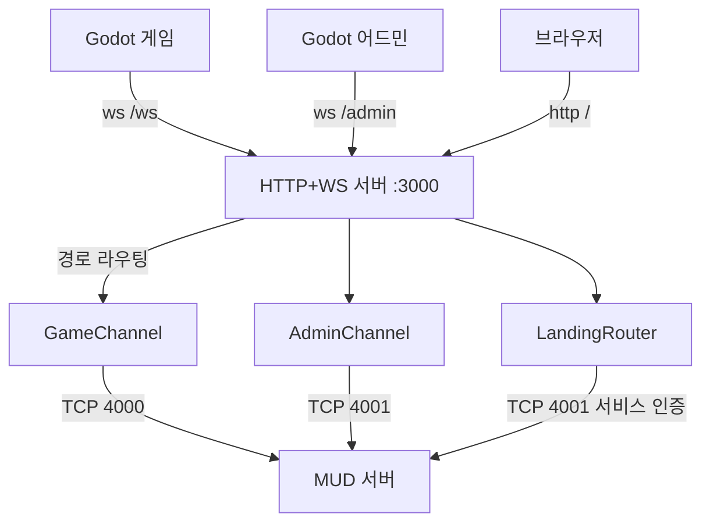
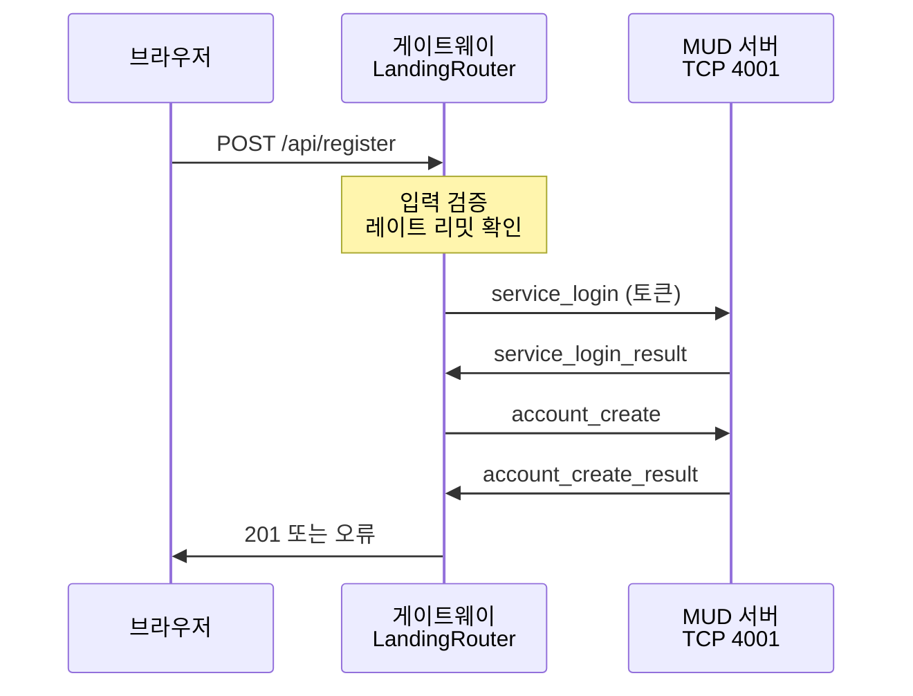

# Design Document

## 개요

저장소를 세 구성 요소(터미널 클라이언트, 게이트웨이, 웹 어드민)에서 두 구성 요소(게이트웨이, 랜딩 사이트)로 재편한다. Godot 클라이언트는 같은 저장소에 편입되지만 별도 스펙이 다룬다.

게이트웨이의 성격이 바뀐다. 텍스트를 브라우저 터미널로 중계하던 계층이 JSON 라인을 WebSocket 프레임으로 변환하는 얇은 계층이 된다. 내용을 해석하지 않으므로 로직은 줄고, 대신 프레임 경계 처리가 정확해야 한다.

## 저장소 구조 변경

```
현재                                  변경 후
src/                                  src/
  client/          삭제                 server/
    index.html                           gateway.ts
    main.ts                              telnet-client.ts
    terminal-manager.ts                  line-framer.ts        신설
    i18n.ts                              connection-pool.ts
    __tests__/                           logger.ts
  server/                                start.ts
    gateway.ts       유지                landing/              신설
    telnet-client.ts 유지                  router.ts
    connection-pool.ts 유지                account-client.ts
    sanitizer.ts     제거                  rate-limit.ts
    logger.ts        유지                public/               신설
    start.ts         유지                  index.html
    webadmin/        삭제                  style.css
      admin-router.ts                      app.js
      auth.ts                            __tests__/
      db-client.ts                     shared/
      public/                            types.ts
  shared/                            godot/                  별도 스펙
    types.ts         갱신
    types.js         제거
```

삭제 규모는 터미널 클라이언트 약 2,900행, 웹 어드민 약 6,900행이다. 두 스펙(`browser-telnet-terminal`, `web-admin-panel`)도 폐기 기록만 남긴다.

## 라인 프레이밍

이번 스펙의 핵심이다. 현재 구현은 다음과 같다.

```typescript
// 현재: forwardTelnetToWebSocket
const filtered = filterTelnetCommands(data);   // Buffer
const text = filtered.toString('utf-8');       // 즉시 디코딩
ws.send(JSON.stringify({ type: 'data', payload: text }));
```

두 가지 결함이 있다. TCP 청크가 라인 경계와 무관하므로 JSON이 쪼개지거나 뭉친 상태로 전달되고, 청크 경계에서 멀티바이트 문자가 분할되면 `toString('utf-8')`이 대체 문자를 만들어 한국어가 손상된다.

### LineFramer 설계

`src/server/line-framer.ts`에 상태를 갖는 프레이머를 둔다. 연결마다 하나의 인스턴스를 보유한다.

```typescript
class LineFramer {
  private buffer: Buffer = Buffer.alloc(0);
  private readonly maxLineBytes: number;

  // 청크를 넣고 완성된 라인 배열을 받는다
  push(chunk: Buffer): string[] {
    this.buffer = Buffer.concat([this.buffer, chunk]);
    const lines: string[] = [];

    let index: number;
    while ((index = this.buffer.indexOf(0x0a)) !== -1) {
      const raw = this.buffer.subarray(0, index);
      this.buffer = this.buffer.subarray(index + 1);
      // 개행 직전의 CR 제거
      const line = raw.length > 0 && raw[raw.length - 1] === 0x0d
        ? raw.subarray(0, raw.length - 1)
        : raw;
      if (line.length > 0) {
        lines.push(line.toString('utf-8'));
      }
    }

    if (this.buffer.length > this.maxLineBytes) {
      throw new LineTooLongError(this.buffer.length);
    }
    return lines;
  }
}
```

핵심은 개행을 찾은 뒤에야 `toString('utf-8')`을 호출하는 것이다. 라인 하나는 완결된 UTF-8 시퀀스이므로 경계 분할이 발생하지 않는다.

빈 라인은 버린다. 서버가 개행을 연속으로 보내는 경우 빈 프레임이 클라이언트로 가지 않게 한다.

CR 처리를 넣는 이유는 Telnet 관례상 서버가 `\r\n`을 보낼 가능성이 있어서다. 프로토콜 계약은 `\n`을 규정하지만 방어적으로 CR을 제거한다.

`maxLineBytes`를 초과하면 예외를 던지고 연결을 종료한다. 악의적 입력이나 프로토콜 위반으로 버퍼가 무한히 커지는 것을 막는다.

### 협상 구간과 페이로드 구간

Telnet IAC 협상은 연결 초기에만 발생한다. 협상 바이트는 라인 구조를 갖지 않으므로 프레이머에 넣기 전에 걸러야 한다.

```
TCP 청크
   ↓
filterTelnetCommands()   IAC 시퀀스 제거 (기존 구현 유지)
   ↓
LineFramer.push()        개행 경계 복원
   ↓
완성 라인 배열
   ↓
각 라인을 WebSocket 텍스트 프레임으로 전송
```

기존 `filterTelnetCommands`를 유지하는 이유는 서버가 협상을 계속 수행하기 때문이다. 협상이 끝나면 IAC 바이트가 나타나지 않으므로 이 필터는 실질적으로 통과 경로가 된다. 서버측에서 협상을 제거하면 이 필터도 함께 제거할 수 있다.

미해결: `filterTelnetCommands`는 상태를 갖지 않으므로 IAC 시퀀스가 TCP 청크 경계에서 분할되면 잘못 처리한다. 3바이트 협상의 첫 바이트만 도착한 경우 잔여 바이트가 페이로드로 새어 들어가 프레이머에 전달된다. 협상은 접속 직후 한 번에 전송되므로 실제 발생 확률은 낮지만, 서버가 협상을 제거하기 전까지 남는 위험이다. 협상을 제거하면 이 코드가 사라지므로 상태를 갖는 필터로 고치지 않고 둔다.

### 역방향

WebSocket 프레임을 TCP로 보낼 때 개행을 붙인다.

```typescript
telnet.write(frameText + '\n');
```

프레임 내용에 개행이 포함되어 있으면 프로토콜 위반이다. 게이트웨이는 이를 검출해 오류를 기록하고 해당 프레임을 버린다. JSON 문자열 값의 개행은 `\n` 이스케이프로 표현되므로 실제 개행 바이트가 나타날 이유가 없다.

### 프레임 포맷

현재는 `{type:'data', payload:'<텍스트>'}` 봉투로 감싼다. 페이즈2에서는 이 봉투가 불필요하다. 서버가 이미 구조화된 JSON을 보내므로 게이트웨이가 다시 감싸면 이중 봉투가 된다.

```
현재:  서버 텍스트 → { type:'data', payload:'...' } → WS
변경:  서버 JSON 라인 → 그대로 WS 프레임
```

`WSMessage` 타입은 게이트웨이 자신이 생성하는 제어 메시지에만 쓴다.

| 방향 | 용도 | 예 |
|---|---|---|
| 게이트웨이 → 클라이언트 | 연결 상태 통지 | `{type:'gateway_connected'}`, `{type:'gateway_error', reason:'...'}` |
| 서버 → 클라이언트 | 게임 메시지 | 서버 JSON 라인 그대로 통과 |

게이트웨이 제어 메시지의 `type`은 `gateway_` 접두어를 붙여 서버 메시지와 구분한다. 프로토콜 계약의 "알 수 없는 type은 무시" 규칙에 의해 서버는 이 메시지를 보지 않으며, 클라이언트만 해석한다.

## 게이트웨이 구조



한 프로세스가 3000 포트 하나를 열고 경로로 분기한다. 현재도 게이트웨이와 웹 어드민이 같은 HTTP 서버를 공유하는 구조이므로 패턴이 유지된다.

### 업그레이드 경로 제한

현재는 `noServer: true`로 만든 WebSocketServer를 `upgrade` 이벤트에서 무조건 `handleUpgrade`한다. 경로 검증이 없어 어떤 경로로든 게임 세션이 열린다.

```typescript
httpServer.on('upgrade', (req, socket, head) => {
  const path = new URL(req.url ?? '/', 'http://localhost').pathname;

  if (path === '/ws') {
    gameWss.handleUpgrade(req, socket, head, (ws) => {
      gameWss.emit('connection', ws, req);
    });
  } else if (path === '/admin') {
    adminWss.handleUpgrade(req, socket, head, (ws) => {
      adminWss.emit('connection', ws, req);
    });
  } else {
    socket.write('HTTP/1.1 404 Not Found\r\n\r\n');
    socket.destroy();
  }
});
```

게임과 어드민에 별도 WebSocketServer 인스턴스를 둔다. 두 채널의 연결 풀과 상한을 독립적으로 관리할 수 있다.

### 어드민 채널

게임 채널과 같은 중계 로직을 쓰지만 대상 포트가 4001이고 IAC 협상이 없다. 따라서 `filterTelnetCommands`를 적용하지 않고 `LineFramer`만 쓴다.

어드민 인증은 MUD 서버가 담당한다. 게이트웨이는 인증 상태를 알지 못하고 중계만 한다. 기존 웹 어드민의 쿠키 세션과 메모리 세션 맵은 전부 사라진다.

### 연결 풀과 상한

`connection-pool.ts`를 유지하되 무효 설정을 정리한다.

| 항목 | 현재 | 변경 |
|---|---|---|
| `MAX_CONNECTIONS` | `.env.example`과 compose에 있으나 `start.ts`가 읽지 않음 | 읽어서 반영 |
| `CONNECTION_TIMEOUT` | 동일하게 무효 | 읽어서 반영 또는 제거 |
| 상한 200 | `startServer`에 하드코딩 | 환경변수 기본값으로 이동 |
| `serverVersion '1.0.0'` | `gateway.ts:15` 하드코딩 | 제거. 서버 `welcome`이 제공 |

### sanitizer 처리

`sanitizer.ts`(124행)와 테스트(545행)는 `gateway.ts`에서 임포트만 되고 호출되지 않는다. OSC/DCS 시퀀스 필터링이 의도됐으나 실제 경로에 연결되지 않았다.

제거를 권한다. 페이즈2에서 페이로드가 JSON이 되므로 터미널 제어 시퀀스가 문제되지 않는다. JSON 문자열 안의 제어문자는 서버가 검증하며, Godot은 터미널 에뮬레이터가 아니라 이스케이프 시퀀스를 해석하지 않는다.

## 랜딩 사이트

### 기술 선택

빌드 도구를 쓰지 않는다. `vite.config.ts`를 제거하는데 랜딩만을 위해 번들러를 다시 도입하면 이득이 없다. 정적 HTML, CSS, 바닐라 JavaScript로 구성한다.

이 판단의 근거는 랜딩의 요구사항이 단순하기 때문이다. 게임 소개, 스크린샷, 다운로드 링크, 회원가입 폼 하나다. 프레임워크가 필요한 규모가 아니다.

### 회원가입 경로



`src/server/landing/account-client.ts`가 MUD 서버 4001에 TCP로 접속해 서비스 인증 후 계정을 만든다. `telnet-client.ts`와 `LineFramer`를 재사용한다.

서비스 토큰은 `LANDING_SERVICE_TOKEN` 환경변수로 주입한다. 브라우저에 전달되지 않으며 서버측 코드에서만 읽는다.

> 철회(2026-08-16). 위 회원가입 흐름은 구현하지 않는다. 계정 생성은 Godot 클라이언트가 게임 채널의 `register` 로 직접 한다. 서비스 토큰과 서비스 주체 인증도 함께 없앴다.

연결 방식은 요청마다 새 연결을 맺고 닫는다. 회원가입은 빈도가 낮으므로 연결 유지가 불필요하고, 상태 없는 처리가 단순하다.

### 입력 검증

브라우저와 게이트웨이 양쪽에서 검증하되 최종 판정은 MUD 서버에 맡긴다. 사용자명 중복 검사는 DB 조회가 필요하므로 서버만 판단할 수 있다.

| 항목 | 브라우저 | 게이트웨이 | MUD 서버 |
|---|---|---|---|
| 필수 입력 | 확인 | 확인 | 확인 |
| 사용자명 길이/문자 | 확인 | 확인 | 확인 |
| 비밀번호 길이 | 확인 | 확인 | 확인 |
| 비밀번호 확인 일치 | 확인 | 확인 | 해당 없음 |
| 이메일 형식 | 확인 | 확인 | 확인 |
| 사용자명 중복 | 불가 | 불가 | 확인 |

### 남용 방지

`src/server/landing/rate-limit.ts`에 IP 기준 슬라이딩 윈도우 제한을 둔다. 기존 프로젝트 규칙의 `RateLimiter` 패턴을 따른다.

기본값은 IP당 시간당 5회다. 초과 시 429를 반환한다. 리버스 프록시 뒤에 있으므로 `X-Forwarded-For`를 신뢰할지 결정해야 하며, nginx가 설정하는 값을 사용한다.

CAPTCHA는 이번 범위에 포함하지 않는다. 필요해지면 추가할 수 있는 지점으로 기록한다.

### 정적 파일 서빙

개발 환경에서는 게이트웨이 프로세스가 `src/server/public/`을 서빙한다. 프로덕션에서는 nginx가 담당하고 게이트웨이는 WebSocket 두 채널만 처리한다.

```
개발:      브라우저 → 게이트웨이 :3000 → 정적 파일 + API
프로덕션:  브라우저 → nginx → 정적 파일
                          └→ /ws, /admin  → 게이트웨이 :3000
```

경로 순회 방어는 기존 웹 어드민의 `handleStaticFile` 구현을 참고한다. 그 코드는 삭제되지만 방어 로직 자체는 재사용 가치가 있다.

### 언어

영국 영어를 기본으로 한다. `-ise` 어미, `-our` 어미, `centre`, `defence` 표기를 따른다. 한국어 병기 여부는 구현 시 결정하되, 게임 클라이언트가 다국어를 지원하므로 랜딩도 한국어를 제공하는 편이 일관된다.

## 테스트 재구성

`vite.config.ts`에 vitest 기본 설정(jsdom 환경, `src/client/__tests__/setup.ts` 로드)이 들어 있어 삭제하면 `npm test`가 깨진다.

```
현재
  npm test        → vite.config.ts의 test 블록 (jsdom)
  npm run test:server → vitest.config.server.ts
  npm run test:e2e    → vitest.config.e2e.ts
  npm run test:load   → vitest.config.load.ts

변경
  npm test        → vitest.config.server.ts (node 환경)
  npm run test:e2e    → 유지
  npm run test:load   → 유지
```

`jsdom`과 `happy-dom`은 브라우저 환경 테스트가 사라지면 불필요하다. 랜딩의 바닐라 JS를 테스트할 계획이 없다면 제거한다.

유지되는 테스트:

| 파일 | 상태 |
|---|---|
| `src/server/__tests__/gateway.property.test.ts` | 유지. 텍스트 프로토콜 전제 부분은 JSON 라인 전제로 갱신 |
| `src/__tests__/e2e.test.ts` | 유지. `GatewayServer`와 `ws`만 사용 |
| `src/__tests__/load.test.ts` | 유지 |
| `src/server/__tests__/sanitizer*.test.ts` | 삭제 (sanitizer 제거 시) |
| `src/client/__tests__/**` | 삭제 |

신규 테스트는 `LineFramer`에 집중한다. property-based 테스트(`fast-check`가 이미 의존성에 있음)가 적합하다. 임의의 바이트 분할 지점에서 라인 복원이 항상 원본과 일치해야 한다는 속성을 검증한다.

## 빌드와 배포

### tsconfig

`tsconfig.json`은 `noEmit`으로 타입 검사만 수행하며 `include: src/**/*`이다. 클라이언트 삭제 후 DOM lib이 불필요해지지만, 랜딩의 바닐라 JS를 타입 검사 대상에 넣을지에 따라 달라진다.

랜딩을 순수 JS로 두면 타입 검사에서 제외하고 DOM lib을 제거한다. 이 편이 단순하다.

`tsconfig.server.json`의 산출물 중첩(`dist/server/server/*.js`)은 `rootDir: ./src`와 `outDir: ./dist/server` 조합의 결과다. 이번 범위에서 바꾸지 않는다. Dockerfile의 CMD가 이 경로에 의존하므로 함께 바꿔야 하고, 이득이 크지 않다.

### Dockerfile

변경 사항은 `build:server`의 웹 어드민 정적 복사 단계 제거와 랜딩 정적 파일 복사 추가다.

```
제거: cp -r src/server/webadmin/public dist/server/server/webadmin/public
추가: src/server/public → 이미지에 포함
```

런타임 스테이지의 `sed -i '/"type": "module"/d' package.json`은 유지한다. ESM 선언을 제거해 CommonJS로 실행하는 우회이며 `tsconfig.server.json`이 CommonJS를 출력하므로 필요하다.

### nginx

```
제거:  location /webadmin  → gateway:3000
추가:  location /admin     → gateway:3000 (WebSocket 업그레이드)
추가:  location /api/      → gateway:3000
갱신:  location /          → 랜딩 정적 루트
유지:  location /ws        → gateway:3000 (WebSocket 업그레이드)
```

### docker-compose

환경변수를 실제 사용 항목으로 정리한다.

| 변수 | 처리 |
|---|---|
| `WS_PORT` | 유지 |
| `TELNET_HOST` | 유지 |
| `TELNET_PORT` | 유지 (4000) |
| `ADMIN_PORT` | 추가 (4001) |
| `MAX_CONNECTIONS` | 실제 반영 |
| `CONNECTION_TIMEOUT` | 반영 또는 제거 |
| `LOG_LEVEL` | 유지 |

`data` 볼륨은 웹 어드민이 SQLite를 직접 열기 위해 마운트했던 것이다. 어드민 제거 후 불필요하므로 제거한다. 이것이 이번 변경의 중요한 부수 효과다. 게이트웨이가 더 이상 MUD 데이터베이스에 접근하지 않는다.

## 실행 순서 제약

| 이 스펙의 작업 | 선행 조건 |
|---|---|
| 라인 프레이밍 | 서버의 JSON 송신 전환과 같은 시점 |
| 웹 어드민 삭제 | 서버 어드민 채널 구현 완료 |
| 어드민 채널 프록시 | 서버 TCP 4001 리스너 구현 완료 |
| 랜딩 회원가입 | 서버 계정 생성 경로 구현 완료 |

터미널 클라이언트 삭제는 선행 조건이 없다. 코드 의존성이 없고 서버 변경과 무관하므로 가장 먼저 진행할 수 있다.

## 위험과 대응

라인 프레이밍 전환 시점이 서버 JSON 전환과 맞물린다. 두 저장소를 동시에 배포해야 하며, 어긋나면 통신이 성립하지 않는다. 개발 중에는 서버 하니스로 서버를 먼저 검증하고, 게이트웨이는 `LineFramer` 단위 테스트로 독립 검증한 뒤 통합한다.

웹 어드민 삭제 전까지 두 어드민 경로가 공존한다. 같은 DB를 조작하면 서버 캐시와 불일치가 발생하므로 이 기간을 최소화한다. 서버 어드민이 동작하는 것을 확인한 즉시 Node 웹 어드민을 제거한다.

랜딩의 회원가입이 서비스 토큰에 의존한다. 토큰이 유출되면 임의 계정 생성이 가능하다. 토큰을 환경변수로만 주입하고, MUD 서버의 4001 포트를 외부에 노출하지 않으며, 서비스 인증 경로가 계정 생성만 허용하도록 서버에서 제한한다.
