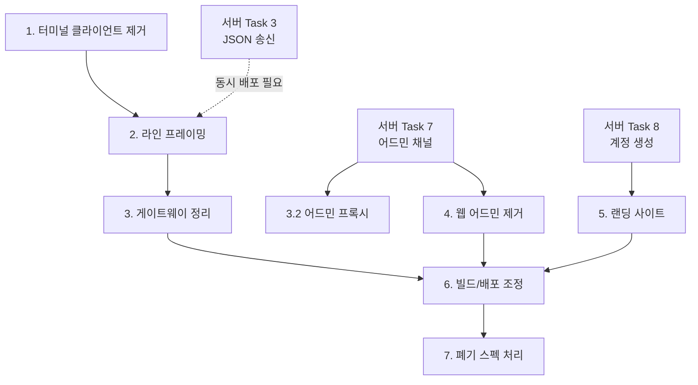

# Implementation Plan

## Overview

각 단계는 독립 커밋으로 진행하고 `npm run type-check:server`와 관련 테스트를 통과해야 한다.

작업 순서는 선행 조건에 따라 결정된다. 터미널 클라이언트 삭제는 서버 변경과 무관하므로 먼저 진행하고, 라인 프레이밍은 단위 테스트로 독립 검증한 뒤 서버 JSON 전환 시점에 통합한다. 웹 어드민 삭제와 랜딩 회원가입은 서버측 구현 완료를 기다린다.

프로토콜 계약은 서버 저장소 `docs/protocol/`을 기준으로 한다.

## Tasks

- [x] 1. 터미널 웹 클라이언트 제거
- [x] 1.1 클라이언트 소스와 테스트 삭제
  - `src/client/` 디렉터리 전체를 제거한다. `index.html`, `main.ts`, `terminal-manager.ts`, `i18n.ts`와 `__tests__/` 아래 4개 파일이 대상이다.
  - `src/shared/types.js`(커밋된 컴파일 산출물 잔재)를 제거한다.
  - `src/client/` 전체(`index.html`, `main.ts`, `terminal-manager.ts`, `i18n.ts`, `__tests__/` 4파일)와 `src/shared/types.js` 를 삭제했다.
  - `src/shared/types.ts` 는 남긴다. 게이트웨이의 `GatewayMessage` 정의가 여기 있다.
  - `src/client/main.ts` 에 남아 있던 `HTMLElement.disabled` 타입 오류 2건이 함께 사라졌다.
  - _Requirements: 1.1, 1.6_
- [x] 1.2 테스트 인프라 재배선
  - `vite.config.ts`를 제거한다. `npm test`가 `vitest.config.server.ts`를 사용하도록 `package.json`을 갱신한다. 삭제 전에 재배선을 먼저 적용해 테스트가 끊기지 않게 한다.
  - `jsdom`, `happy-dom` 의존성의 필요 여부를 판정해 불필요하면 제거한다.
  - 재배선을 먼저 적용하고 통과를 확인한 뒤 삭제했다. `npm test` 가 `vitest.config.server.ts` 를 쓴다.
  - `vite.config.ts` 를 삭제했다. vitest 기본 설정(jsdom, `src/client/__tests__/setup.ts`)이 여기 얹혀 있었다.
  - `jsdom`, `@types/jsdom`, `happy-dom`, `vite` 를 제거했다. 남은 테스트는 모두 `environment: node` 다.
  - _Requirements: 6.1, 6.2, 6.7_
- [x] 1.3 의존성과 스크립트 정리
  - `@xterm/xterm`, `@xterm/addon-fit`, `@xterm/addon-webgl`, `@xterm/addon-attach`를 제거한다.
  - `package.json`에서 `dev:client`, `build:client`, `preview`를 제거하고 `build`를 서버 전용으로 갱신한다.
  - `.env.example`에서 `VITE_WS_URL`을 제거한다.
  - `@xterm/*` 4종을 제거했다. 런타임 의존성은 `winston` 과 `ws` 둘만 남는다.
  - `dev:client`, `build:client`, `preview` 를 제거하고 `build` 를 `build:server` 로 바꿨다. `.env.example` 의 `VITE_WS_URL` 도 없앴다.
  - `package.json` 의 `description` 과 `keywords` 를 게이트웨이 기준으로 고쳤다. 브라우저 터미널을 설명하고 있었다.
  - 루트 `tsconfig.json` 을 삭제하고 `type-check` 를 서버 설정으로 돌렸다. `include: ["src/**/*"]` 와 DOM 라이브러리가 클라이언트를 대상으로 한 것이었다. Task 6.1 의 일부를 앞당긴 셈이다.
  - _Requirements: 1.2, 1.3, 1.4, 1.5_
- [x] 1.4 잔여 테스트 확인
  - `src/server/__tests__/gateway.property.test.ts`, `src/__tests__/e2e.test.ts`, `src/__tests__/load.test.ts`가 통과함을 확인한다. 이들은 `GatewayServer`와 `ws`만 사용하므로 영향받지 않아야 한다.
  - 전제가 틀렸다. `e2e.test.ts` 와 `load.test.ts` 는 이미 실패하고 있었다. Task 2(봉투 제거)가 `{type:"data", payload}` 규약을 없앴는데 두 파일이 그 규약을 그대로 쓰고 있었다. `npm test` 가 `vite.config.ts`(클라이언트 테스트)를 쓰고 있어 드러나지 않았다.
  - 두 파일을 현재 JSON 라인 프로토콜로 다시 썼다. `gateway.property.test.ts` 와 겹치는 부분(용량, 정리, 전달)을 덜어내고 전체 사슬·다중 사용자·부하 특성에 집중했다.
  - `e2e.test.ts` 5건: welcome 도달, 라인 왕복, 다중 사용자 격리, 개행 프레임 거부, 연결 해제 후 풀 정리.
  - `load.test.ts` 3건: 동시 연결 100개, 상한 초과 거부, 연결 50개 왕복. 실측 연결당 1.8ms.
  - `README.md` 와 `DEPLOYMENT.md` 는 손대지 않았다. Task 6.4 의 범위이며 랜딩 사이트 내용이 있어야 다시 쓸 수 있다. 현재 xterm.js 를 주요 기능으로 설명하고 있다.
  - 검증: `npm run type-check` 통과, `npm test` 38건, `npm run test:e2e` 5건, `npm run test:load` 3건.
  - _Requirements: 1.7, 6.3, 6.4_

- [x] 2. 라인 프레이밍 구현
- [x] 2.1 LineFramer 작성
  - `src/server/line-framer.ts`에 상태를 갖는 프레이머를 만든다. 청크를 누적하고 개행 경계에서 분할하며, 완성된 라인에 대해서만 UTF-8 디코딩을 수행한다. 개행 직전 CR을 제거하고 빈 라인은 버린다. 라인 길이 상한(256KB) 초과 시 예외를 던진다.
  - _Requirements: 3.1, 3.2, 3.3, 3.9_
- [x] 2.2 LineFramer 속성 테스트
  - `fast-check`로 임의의 바이트 분할 지점에서 라인 복원이 원본과 일치하는지 검증한다. 한 청크에 여러 라인이 들어온 경우, 라인이 여러 청크에 걸친 경우, 멀티바이트 문자가 경계에서 분할된 경우를 포함한다. 한국어 문자열 왕복을 반드시 포함한다.
  - _Requirements: 6.5_
- [x] 2.3 게이트웨이 데이터 경로에 통합
  - `telnet-client.ts`와 `gateway.ts`의 수신 경로를 `filterTelnetCommands` → `LineFramer.push()` → 라인별 WebSocket 프레임 전송으로 바꾼다. 송신 경로는 프레임 텍스트에 개행을 붙여 TCP로 쓴다. 프레임 내용에 개행이 있으면 오류를 기록하고 버린다.
  - _Requirements: 3.4, 3.5, 3.6, 3.8_
- [x] 2.4 프레임 봉투 제거
  - 서버 JSON 라인을 `{type:'data', payload:...}`로 다시 감싸지 않고 그대로 프레임으로 전달한다. 게이트웨이 자신의 제어 메시지에만 `gateway_` 접두어 타입을 사용한다. `src/shared/types.ts`의 `WSMessage`를 이에 맞게 갱신한다.
  - `WSMessage`를 `GatewayMessage` 유니온으로 교체했다. `data`/`connect`/`version`/`resize` 타입이 사라지면서 요구사항 4.5(하드코딩 `serverVersion` 제거)와 4.6(`resize` 폐기)이 함께 해소되었다. Task 3.4에서 다시 다루지 않는다.
  - _Requirements: 3.7, 3.10, 4.5, 4.6, 4.7_
- [x] 2.5 기존 테스트 갱신
  - `gateway.property.test.ts`에서 텍스트 프로토콜을 전제한 부분을 JSON 라인 전제로 갱신한다.
  - _Requirements: 6.6_

- [x] 3. 게이트웨이 정리
- [x] 3.1 업그레이드 경로 제한
  - `upgrade` 핸들러에서 경로를 검증한다. `/ws`는 게임 채널, `/admin`은 어드민 채널로 라우팅하고 그 외는 404로 거부한다. 게임과 어드민에 별도 `WebSocketServer` 인스턴스를 둔다.
  - `GAME_PATH`(`/ws`)와 `ADMIN_PATH`(`/admin`)를 상수로 두고 `upgrade` 핸들러가 경로로 라우팅한다. 채널마다 별도 `WebSocketServer`(noServer)를 둔다. 그 밖의 경로는 404 를 쓰고 소켓을 끊는다. 쿼리 문자열이 붙어도 경로만 비교한다.
  - 이전에는 모든 경로를 수락했다. 클라이언트 개발 URL 도 경로 없이 접속했으므로 `/ws` 를 붙였다.
  - _Requirements: 4.2_
- [x] 3.2 어드민 채널 프록시
  - `/admin` WebSocket을 MUD 서버 TCP 4001로 중계한다. IAC 협상이 없으므로 `filterTelnetCommands`를 적용하지 않고 `LineFramer`만 사용한다. 인증은 서버가 담당하므로 게이트웨이는 상태를 갖지 않는다.
  - _Requirements: 4.3_
  - `ClientConnection` 에 `channel` 을 추가하고 채널에 맞는 상위 포트로 연결한다. 게임은 `TELNET_PORT`, 어드민은 `ADMIN_PORT` 다.
  - 어드민 채널은 `filterTelnetCommands` 를 거치지 않고 `LineFramer` 만 쓴다. 서버가 IAC 협상을 하지 않는다.
  - 게이트웨이는 인증 상태를 갖지 않는다. 서버가 두 주체(관리자·서비스)를 판정한다.
  - 선행 조건: 서버 `server-json-protocol` Task 7.1 완료
- [x] 3.3 데드 코드 제거
  - `sanitizer.ts`와 `__tests__/sanitizer.test.ts`, `sanitizer.property.test.ts`를 제거하고 `gateway.ts`의 미사용 임포트를 정리한다. JSON 페이로드에는 터미널 제어 시퀀스가 문제되지 않으며 Godot은 이스케이프를 해석하지 않는다.
  - `sanitizer.ts` 와 테스트 2개를 삭제하고 `gateway.ts` 의 미사용 임포트를 정리했다. `gateway.ts` 에서 임포트만 되고 호출되지 않는 데드 코드였다.
  - _Requirements: 4.1_
- [x] 3.4 설정 반영
  - `MAX_CONNECTIONS`와 `CONNECTION_TIMEOUT`을 `start.ts`에서 읽어 반영한다. 하드코딩된 상한 200을 환경변수 기본값으로 옮긴다. `ADMIN_PORT`를 추가한다.
  - `serverVersion`(4.5)과 `resize`(4.6)는 Task 2.4에서 이미 제거되었다.
  - `GatewayServer` 생성자를 옵션 오브젝트로 바꿨다. 위치 인자 다섯 개가 늘어나 순서를 틀리기 쉬웠다.
  - `MAX_CONNECTIONS`, `CONNECTION_TIMEOUT`, `ADMIN_PORT` 를 `start.ts` 에서 읽는다. 하드코딩된 상한 200 은 기본값으로 옮겼다.
  - `CONNECTION_TIMEOUT` 은 붙을 곳이 없었다. 유휴 연결 정리를 새로 구현했다. `ClientConnection.lastActivity` 를 프레임이 오갈 때마다 갱신하고 30초 주기로 기준을 넘은 연결을 닫는다. 계약이 클라이언트에 60초 ping 을 요구하므로 기본값을 300초로 뒀다. `.env.example` 의 30000 은 그 요구와 어긋나 정정했다.
  - `.env.example` 과 `docker-compose.yml` 에 `ADMIN_PORT` 와 `CONNECTION_TIMEOUT` 을 넣고 `VITE_WS_URL` 에 `/ws` 를 붙였다.
  - 검증: `channel-routing.test.ts` 7건 추가로 서버 테스트 38건. 실행 중인 MUD 서버를 대상으로 두 채널 도달을 실측했다. `/ws` 는 `channel: "game"` welcome, `/admin` 은 `channel: "admin"` welcome 과 `admin_login_result success: true` 를 받았고 정의되지 않은 경로는 거부됐다.
  - _Requirements: 4.4_

- [x] 4. 웹 어드민 제거
  - 선행 조건: 서버 `server-json-protocol` Task 7 전체 완료. 두 어드민 경로가 같은 데이터베이스를 조작하는 기간을 최소화해야 한다.
- [x] 4.1 서버측 어드민 코드 삭제
  - `src/server/webadmin/` 디렉터리 전체를 제거한다. `admin-router.ts`(1,070행), `auth.ts`(110행), `db-client.ts`(1,960행), `public/` 3개 파일(3,846행)이 대상이다.
  - `start.ts`에서 `DBClient`, `AuthModule`, `AdminRouter` 생성과 주입을 제거한다.
  - `gateway.ts`에서 HTTP 요청을 `AdminRouter`로 위임하는 경로를 제거한다.
  - `src/server/webadmin/` 6,986행을 삭제했다. `admin-router.ts` 1,070행, `db-client.ts` 1,960행, `auth.ts` 110행, `public/` 3,846행이다.
  - `start.ts` 에서 `DBClient`·`AuthModule`·`AdminRouter` 생성과 주입을 없앴다. 게이트웨이는 이제 상태를 갖지 않고 데이터베이스에 접근하지 않는다.
  - `gateway.ts` 의 HTTP 서버는 404 만 응답한다. WebSocket 업그레이드만 받는다. 랜딩 정적 서빙은 Task 5 에서 다룬다.
  - _Requirements: 2.1, 2.3, 2.4, 2.6_
- [x] 4.2 의존성과 빌드 단계 정리
  - `better-sqlite3` 의존성을 제거한다. 게이트웨이가 MUD 데이터베이스에 직접 접근하지 않게 된다.
  - `build:server` 스크립트에서 `cp -r src/server/webadmin/public` 단계를 제거한다.
  - `docker-compose.yml`의 `data` 볼륨 마운트를 제거한다. 어드민이 SQLite를 열기 위한 것이었다.
  - `better-sqlite3` 와 `@types/better-sqlite3` 를 제거했다. 게이트웨이가 MUD 데이터베이스를 직접 열지 않게 됐다. 두 어드민 경로가 같은 DB 를 조작하던 기간이 끝났다.
  - `build:server` 의 `cp -r src/server/webadmin/public` 단계를 제거했다.
  - `docker-compose.yml` 의 `./data:/app/data` 마운트와 `Dockerfile` 의 `data` 디렉터리 생성을 제거했다. `.env.example` 의 `WEBADMIN_USERNAME`·`WEBADMIN_PASSWORD`·`DATA_DIR` 도 없앴다.
  - 검증: 타입 검사와 서버 테스트 38건 통과. 실행 중인 MUD 서버를 대상으로 두 채널이 그대로 도달하고 `GET /` 과 `GET /webadmin` 이 404 임을 실측했다.
  - _Requirements: 2.2, 2.5_

- [ ] 5. 랜딩 사이트
  - 선행 조건: 서버 `server-json-protocol` Task 8(계정 생성 경로) 완료
- [ ] 5.1 정적 페이지 작성
  - `src/server/public/`에 `index.html`, `style.css`, `app.js`를 작성한다. 빌드 도구를 사용하지 않는 정적 파일로 구성한다. 게임 소개, 스크린샷, 클라이언트 다운로드 링크, 회원가입 폼을 포함한다. 영국 영어를 사용한다.
  - _Requirements: 5.1, 5.2, 5.7_
- [ ] 5.2 정적 서빙 라우터
  - `src/server/landing/router.ts`에 정적 파일 서빙을 구현한다. 경로 순회 방어를 포함한다. 개발 환경에서 게이트웨이가 서빙하고 프로덕션에서는 nginx가 담당하므로, 서빙 활성화를 환경변수로 제어한다.
  - _Requirements: 5.8_
- [ ] 5.3 계정 생성 클라이언트
  - `src/server/landing/account-client.ts`가 MUD 서버 4001에 TCP로 접속해 서비스 인증 후 계정을 만든다. `LineFramer`를 재사용한다. 요청마다 새 연결을 맺고 닫는다. 서비스 토큰은 `LANDING_SERVICE_TOKEN` 환경변수로 주입하며 브라우저에 노출하지 않는다.
  - _Requirements: 5.3, 5.4, 5.9_
- [ ] 5.4 회원가입 엔드포인트
  - `POST /api/register`를 구현한다. 입력 검증(필수 항목, 사용자명 길이와 문자, 비밀번호 길이와 확인 일치, 이메일 형식)을 수행하고 MUD 서버로 전달한다. 서버의 `USERNAME_TAKEN` 응답을 사용자 안내로 변환한다. 비밀번호를 로그에 기록하지 않는다.
  - _Requirements: 5.5, 5.6, 5.9_
- [ ] 5.5 남용 방지
  - `src/server/landing/rate-limit.ts`에 IP 기준 슬라이딩 윈도우 제한을 구현한다. 기본값 IP당 시간당 5회, 초과 시 429를 반환한다. 리버스 프록시 뒤에 있으므로 nginx가 설정하는 `X-Forwarded-For`를 사용한다.
  - _Requirements: 5.10_

- [ ] 6. 빌드와 배포 조정
- [ ] 6.1 tsconfig 정리
  - `tsconfig.json`의 `include` 범위를 서버와 공유 코드로 축소한다. 랜딩을 순수 JS로 두고 타입 검사 대상에서 제외하며 DOM 라이브러리를 제거한다.
  - _Requirements: 7.1, 7.2_
- [ ] 6.2 Dockerfile 갱신
  - 웹 어드민 정적 파일 복사 단계를 제거하고 랜딩 정적 파일을 이미지에 포함한다. 런타임의 `sed -i '/"type": "module"/d'` 우회는 유지한다.
  - _Requirements: 7.3_
- [ ] 6.3 compose와 nginx 갱신
  - `docker-compose.yml`의 환경변수를 실제 사용 항목으로 정리하고 `ADMIN_PORT`, `LANDING_SERVICE_TOKEN`을 추가한다.
  - `nginx.conf`에서 `/webadmin` 프록시를 제거하고 `/admin`(WebSocket 업그레이드)과 `/api/` 프록시를 추가하며 정적 루트를 랜딩으로 맞춘다. `/ws`는 유지한다.
  - _Requirements: 7.4, 7.5, 2.7_
- [ ] 6.4 문서 갱신
  - `README.md`와 `DEPLOYMENT.md`에서 터미널 클라이언트와 웹 어드민 관련 안내를 제거하고 랜딩 사이트와 Godot 클라이언트 배포 절차로 갱신한다.
  - _Requirements: 7.6_
- [ ] 6.5 최종 검증
  - `npm run type-check:server`, `npm test`, `npm run test:e2e`를 통과한다. Docker 이미지 빌드가 성공하고 컨테이너가 기동함을 확인한다.
  - _Requirements: 7.7_

- [x] 7. 폐기 스펙 처리
  - `.kiro/specs/browser-telnet-terminal/`에 폐기 기록을 추가한다. 터미널 클라이언트 제거로 대상이 사라졌음을 명시한다.
  - `.kiro/specs/web-admin-panel/`에 폐기 기록을 추가한다. 어드민 기능이 MUD 서버(`server-json-protocol` Task 7)와 Godot 클라이언트(`godot-client` Task 11)로 이전되었음을 명시한다.
  - 두 스펙의 내용은 삭제하지 않고 이력으로 보존한다.
  - 두 스펙에 이미 계획 단계의 폐기 기록이 있었다(커밋 `8bf2030`). 제거가 실제로 끝났으므로 각 기록 뒤에 `### 제거 완료` 절을 붙여 대상별 처리와 커밋을 남겼다.
  - `browser-telnet-terminal`: 이 스펙이 만든 게이트웨이는 살아 있다는 사실과, e2e·load 테스트가 Task 2 시점부터 조용히 실패하고 있었던 경위를 기록했다.
  - `web-admin-panel`: 두 어드민 경로가 같은 데이터베이스를 조작하던 기간이 끝났음을 명시했다. 이것이 이 스펙의 핵심 문제였다. 어드민 UI 는 `godot-client` Task 11 로 남아 있다.
  - 내용은 삭제하지 않았다. 두 스펙의 체크박스와 본문을 그대로 보존했다.
  - _Requirements: 8.1, 8.2, 8.3_

## Task Dependency Graph



```json
{
  "waves": [
    { "wave": 1, "tasks": ["1.1", "1.2", "1.3", "1.4"] },
    { "wave": 2, "tasks": ["2.1", "2.2"] },
    { "wave": 3, "tasks": ["2.3", "2.4", "2.5"] },
    { "wave": 4, "tasks": ["3.1", "3.3", "3.4"] },
    { "wave": 5, "tasks": ["3.2"] },
    { "wave": 6, "tasks": ["4.1", "4.2"] },
    { "wave": 7, "tasks": ["5.1", "5.2", "5.3", "5.4", "5.5"] },
    { "wave": 8, "tasks": ["6.1", "6.2", "6.3", "6.4", "6.5"] },
    { "wave": 9, "tasks": ["7"] }
  ]
}
```

의존성 요약:

- 1은 선행 조건이 없다. `src/client/`가 `src/server/`나 `src/shared/`를 임포트하지 않으므로 서버 변경과 무관하게 진행할 수 있다.
- 1.2를 1.1보다 먼저 적용해야 한다. `vite.config.ts`에 vitest 설정이 얹혀 있어 순서를 바꾸면 테스트가 끊긴다.
- 2.1과 2.2는 독립 구현과 단위 검증이므로 서버 상태와 무관하게 진행할 수 있다. 2.3의 통합은 서버 JSON 전환과 같은 시점에 배포해야 한다.
- 3.2와 4는 서버 어드민 채널 구현에 의존한다.
- 5는 서버 계정 생성 경로에 의존한다.

## 저장소 간 조율

| 이 스펙의 작업 | 서버 스펙 대응 | 관계 |
|---|---|---|
| 2.3 프레이밍 통합 | Task 3 JSON 송신 전환 | 동시 배포 필요. 어긋나면 통신 불가 |
| 3.2 어드민 프록시 | Task 7.1 어드민 서버 | 서버 선행 |
| 4 웹 어드민 제거 | Task 7 전체 | 서버 선행. 공존 기간 최소화 |
| 5 랜딩 회원가입 | Task 8 계정 생성 | 서버 선행 |

## Notes

- 게이트웨이는 JSON 내용을 해석하거나 변형하지 않는다. 프레임 변환만 담당한다.
- 라인 프레이밍의 핵심은 개행을 찾은 뒤에야 UTF-8 디코딩을 수행하는 것이다. 청크 단위로 디코딩하면 한국어가 손상된다.
- 웹 어드민 제거로 게이트웨이가 MUD 데이터베이스에 접근하지 않게 된다. `better-sqlite3` 의존성과 `data` 볼륨이 함께 사라진다.
- 랜딩은 빌드 도구를 쓰지 않는다. 요구사항 규모가 번들러를 정당화하지 않는다.
- 서비스 토큰이 유출되면 임의 계정 생성이 가능하다. 환경변수로만 주입하고 MUD 서버의 4001 포트를 외부에 노출하지 않는다.
