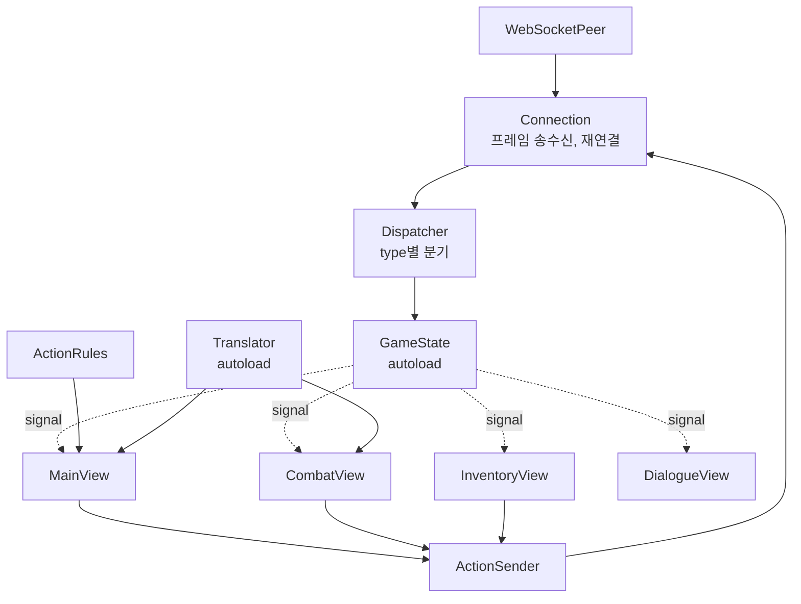

# Design Document

## 개요

Godot 4.x + GDScript로 게임 클라이언트를 구현한다. 서버가 구조화 JSON만 내보내므로 번역, 화면 구성, 어드민 UI가 클라이언트 책임이다.

핵심 설계 원칙은 단방향 데이터 흐름이다. 서버 메시지를 단일 디스패처가 받아 상태 저장소에 반영하고, 화면은 상태를 관찰해 갱신한다. 화면이 서버와 직접 통신하지 않는다.

게임 규칙은 판정하지 않는다. 클라이언트는 표시와 요청만 담당하고 판정은 서버가 한다. 액션 규칙 테이블은 버튼을 구성하기 위한 표시 규칙이며 규칙 판정이 아니다.

## 아키텍처



상태 변경은 신호로 전파한다. 뷰가 상태를 폴링하지 않는다.

## 프로젝트 구조

```
godot/
  project.godot
  scripts/
    net/
      connection.gd          WebSocketPeer 래퍼, 재연결, ping
      dispatcher.gd          메시지 type별 분기
      action_sender.gd       Action_Message 생성, seq 관리
      protocol.gd            타입 상수, 거절 코드 상수
    state/
      game_state.gd          autoload. player/room/inventory/combat/dialogue
      entity.gd              엔티티 데이터 클래스
    i18n/
      translator.gd          autoload. 번역 로딩과 치환
    rules/
      action_rules.gd        엔티티 속성 → 버튼 목록
      terrain.gd             지형 22종 아이콘과 색상
    admin/
      admin_connection.gd    Admin_Channel 전용 연결
      admin_dispatcher.gd
  scenes/
    login/login.tscn
    main/main.tscn
    main/entity_button.tscn
    main/action_popover.tscn
    main/minimap.tscn
    combat/combat.tscn
    dialogue/dialogue.tscn
    shop/shop.tscn
    inventory/inventory.tscn
    status/status.tscn
    admin/admin.tscn
    admin/map_view.tscn
    admin/resource_table.tscn
  resources/
    translations/            서버에서 이관된 9개 JSON
      auth.json
      admin.json
      combat.json
      command.json
      item.json
      moving.json
      status.json
      system.json
      npc.json
```

스크립트 하나가 500행을 넘지 않게 나눈다. 뷰가 커지면 하위 씬으로 분리한다.

## 연결 계층

`connection.gd`가 `WebSocketPeer`를 감싼다.

```gdscript
# 수신 루프 (_process 안)
while socket.get_available_packet_count() > 0:
    var packet := socket.get_packet().get_string_from_utf8()
    var parsed = JSON.parse_string(packet)
    if parsed == null:
        push_warning("JSON 파싱 실패")
        continue
    dispatcher.handle(parsed)
```

게이트웨이가 라인 경계를 복원해 프레임 하나에 JSON 오브젝트 하나를 담아 보내므로 클라이언트는 프레임 단위로 파싱한다. 프레임에 개행이 없다.

재연결은 지수 백오프를 쓴다. 1초에서 시작해 2배씩 늘리고 30초를 상한으로 둔다. 무한 재시도하되 사용자가 취소할 수 있게 한다.

`seq`는 `action_sender.gd`가 관리한다. 1부터 증가시키고 발신 시각과 verb를 함께 기록해 응답 대응과 타임아웃 판정에 쓴다. 응답이 10초 내에 오지 않으면 버튼을 다시 활성화하고 경고를 표시한다.

`welcome` 수신 전에는 어떤 메시지도 보내지 않는다. 연결 직후 상태를 `WAITING_WELCOME`으로 두고 `welcome`을 받으면 `READY`로 전이한다.

## 상태 저장소

`game_state.gd`를 autoload로 둔다.

| 필드 | 출처 메시지 |
|---|---|
| `player` | `login_result`, `player_state` |
| `room` | `room_info` |
| `entities` | `room_info`, `entity_enter`, `entity_leave`, `entity_update` |
| `nearby_rooms` | `room_info` |
| `inventory` | `inventory` |
| `equipped` | `inventory` |
| `combat` | `combat_state` |
| `dialogue` | `dialogue` |
| `shop` | `shop` |
| `chat_log` | `chat` |
| `event_log` | `event` |
| `connection_status` | `connection.gd` |

`entities`는 Entity_UUID를 키로 하는 딕셔너리다. `entity_update`의 `changes`를 병합하고, 대상이 없으면 `look` verb로 전체 재요청한다.

로그는 상한을 둔다. `chat_log`와 `event_log`는 각각 최근 500건만 보관한다.

## 다국어 처리

### 치환 문법 호환

GDScript의 `String.format`이 딕셔너리 키를 이름 있는 자리표시자로 지원한다. 기본 placeholder가 `{_}`이고 언더스코어가 키로 치환되므로 `{name}` 형태가 그대로 동작한다.

```gdscript
"User {id} is {name}.".format({"id": 42, "name": "Godot"})
# → "User 42 is Godot."
```

따라서 서버에서 이관한 번역 파일을 문법 변환 없이 재사용할 수 있다. 이것이 번역 이관의 비용을 크게 낮춘다.

주의할 차이가 두 가지 있다.

- Python `str.format`의 포맷 스펙(`{value:>10}`, `{value!r}`)을 GDScript는 지원하지 않는다. 기존 번역 파일에 포맷 스펙이 있으면 이관 시 제거해야 한다. 이관 작업의 첫 단계에서 전수 확인한다.
- Python은 리터럴 중괄호를 `{{`로 이스케이프하지만 GDScript는 그런 처리가 없다. 번역 값에 리터럴 중괄호가 있으면 별도 처리가 필요하다.

### Translator 설계

```gdscript
# translator.gd (autoload)
var _messages: Dictionary = {}   # key → {locale → text}
var _locale: String = "en"

func t(key: String, params: Dictionary = {}) -> String:
    if not _messages.has(key):
        push_warning("번역 키 없음: %s" % key)
        return key
    var by_locale: Dictionary = _messages[key]
    var text: String = by_locale.get(_locale, by_locale.get("en", key))
    if params.is_empty():
        return text
    return text.format(_resolve_params(params))

# params 값이 언어별 dict면 현재 locale 값을 고른다
func _resolve_params(params: Dictionary) -> Dictionary:
    var out := {}
    for k in params:
        var v = params[k]
        if v is Dictionary and v.has("en"):
            out[k] = v.get(_locale, v.get("en", ""))
        else:
            out[k] = v
    return out
```

키가 없으면 키 문자열을 반환한다. 서버가 새 키를 쓰기 시작했는데 클라이언트가 갱신되지 않은 상황에서 화면이 비지 않게 한다.

Godot의 내장 번역 시스템(`tr()`, `.po`)을 쓰지 않는다. 서버 번역 파일이 flat key + locale dict 구조이고 이를 그대로 재사용하는 편이 이관 비용이 낮다. 또한 서버가 보내는 `params`의 언어별 dict 처리가 필요해 커스텀 계층이 어차피 필요하다.

엔티티 이름과 설명은 같은 방식으로 선택한다. `entity.name`이 `{"en":..., "ko":...}`이므로 현재 locale의 값을 고르고 없으면 `en`으로 폴백한다.

한국어 조사는 번역 값에 완성형으로 유지한다. `{item}을(를) 획득했습니다` 형태를 그대로 표시하며 종성 판별로 조사를 고르는 처리는 하지 않는다. 향후 개선 지점으로 기록한다.

## 액션 규칙 테이블

`action_rules.gd`가 엔티티 속성으로 표시할 동사를 결정한다. 서버는 가용 동사 목록을 보내지 않는다.

### 몬스터 (방)

| 조건 | 표시할 동사 |
|---|---|
| 항상 | `examine`, `attack` |
| 항상 | `talk` (서버가 스크립트 없으면 침묵 응답) |
| `disposition != "hostile"` | `shop_open` |
| `is_alive == false` | 위 동사 대신 `examine`만 |

`can_talk`은 대화 스크립트 존재 여부이며 버튼 표시 조건이 아니라 우선순위 판단에 쓴다. 서버가 스크립트 없는 대상에게도 침묵 응답을 주므로 `talk`은 항상 표시할 수 있다.

상인 구분이 없다. 모든 캐릭터와 거래할 수 있으므로 적대가 아닌 대상에게 `shop_open`을 표시한다.

### 오브젝트 (방)

| 조건 | 표시할 동사 |
|---|---|
| 항상 | `examine`, `get` |
| `is_container == true` | `open` |
| `is_readable == true` | `read` |

### 오브젝트 (인벤토리)

| 조건 | 표시할 동사 |
|---|---|
| 항상 | `examine`, `drop` |
| `is_usable == true` | `use` |
| `equipment_slot != null` 이고 `is_equipped == false` | `equip` |
| `is_equipped == true` | `unequip` |
| `is_readable == true` | `read` |
| 같은 방에 다른 플레이어 존재 | `give` |
| 상점 화면이 열려 있고 `sell_price > 0` | `shop_sell` |
| `is_container == true` | `open` |

### 플레이어 (방)

| 조건 | 표시할 동사 |
|---|---|
| 항상 | `examine`, `follow` |
| 인벤토리에 아이템 보유 | `give` |
| 항상 | 귓속말(채팅 대상 지정) |

### 전투 중

| 조건 | 표시할 동사 |
|---|---|
| 적, 내 턴 | `attack` |
| 항상, 내 턴 | `flee`, `use_item`, `end_turn` |
| 내 턴 아님 | 모든 액션 버튼 비활성 |

### 대상이 없는 액션

일부 verb는 엔티티를 대상으로 하지 않으므로 규칙 테이블이 아니라 화면 버튼으로 배치한다.

| verb | 배치 | 표시 조건 |
|---|---|---|
| `move` | 출구 버튼 | `room.exits`에 해당 방향이 있을 때 |
| `enter` | 방 정보 영역의 진입 버튼 | `room.has_passage`가 참일 때. `room_connections` 기반이므로 대상 엔티티가 없다 |
| `look` | 자동 호출 | `NOT_FOUND` 거절 시 재동기화 |
| `unequip_all` | 인벤토리 화면 버튼 | 장착 중인 장비가 하나 이상일 때 |
| `unfollow` | 상태 영역 버튼 | 따라가는 대상이 있을 때 |
| `emote` | 감정 표현 목록 | 항상 |
| `who` `players_here` | 접속자 목록 버튼 | 항상 |
| `flee` `end_turn` | 전투 액션 바 | 전투 중 내 턴 |
| `dialogue_end` | 대화 창 닫기 버튼 | 대화 중 |
| `request_state` `request_inventory` `request_combat_state` | 화면 진입 시 자동 호출 | 해당 없음 |

`close` verb는 존재하지 않는다. 서버가 컨테이너의 열림 상태를 유지하지 않으며 `open`은 내용을 조회하는 동작이다.

### 거절 응답 처리

| Rejection_Code | 처리 |
|---|---|
| `NOT_APPLICABLE` | 해당 버튼 제거. 사용자에게 오류로 표시하지 않음 |
| `NOT_FOUND` | `look` verb로 방 정보 재동기화 |
| `NOT_AUTHENTICATED` | 로그인 화면으로 전환 |
| `PERMISSION_DENIED` | 안내 표시 |
| `WRONG_STATE` | 안내 표시 |
| `NOT_YOUR_TURN` | 턴 대기 표시 |
| `OUT_OF_RANGE` | 안내 표시 |
| `INSUFFICIENT_FUNDS` | 상점 UI에 부족액 표시 |
| `INSUFFICIENT_QUANTITY` | 수량 입력 상한 조정 |
| `INVENTORY_FULL` | 안내 표시 |
| `SLOT_OCCUPIED` | 교체 확인 제안 |
| `COOLDOWN` | 남은 시간 표시 |
| `TARGET_REQUIRED` `INVALID_PARAMS` | 클라이언트 버그. 로그 기록 |
| `INTERNAL_ERROR` | 재시도 안내 |

낙관적 버튼 구성이므로 `NOT_APPLICABLE`은 정상 동작 범위다. 오류 팝업을 띄우지 않고 조용히 버튼을 제거한다.

## 화면 정의

아래 레이아웃이 화면 구성의 기준이다.

### 로그인

회원가입 경로가 없다. 랜딩 사이트로 안내하는 링크만 제공한다.

```
┌────────────────────────────────────────────────────────────────────────────┐
│                      The Chronicles of Karnas                              │
│                        : Divided Dominion                                  │
│                   ┌──────────────────────────────┐                         │
│                   │ Username  [________________] │                         │
│                   │ Password  [________________] │                         │
│                   │           [ ] 자동 로그인     │                         │
│                   └──────────────────────────────┘                         │
│                        [   로그인   ]  [  종료  ]                          │
│                   계정이 없으신가요? → 웹사이트에서 가입                    │
│                          server: 127.0.0.1:3000  ●연결됨                   │
└────────────────────────────────────────────────────────────────────────────┘
```

### 메인 탐험

방의 모든 오브젝트가 버튼이다. 하단에는 채팅 입력만 있고 명령어 입력창이 없다.

```
┌──────────────────────────────────────────────────────────────────────────────────┐
│ player5426 (SUPERADMIN)  ash_knights │ HP ████████░░ 42/50 │ ST ██████░░░░ 30/50 │
│ ☀ 낮 (16:45)              위치 (0,7) │            [스탯] [인벤토리] [설정] [어드민]│
├───────────────────────────────────────────────────┬──────────────────────────────┤
│ 성문 앞 넓은 광장에 사람들의 발길이 끊이지 않는다. │        Minimap               │
│ 부서진 마차 한 대가 길가에 방치되어 있다.         │   🌲 🌲 🌿 🌿 🛤️            │
│                                                   │   🌲 🌿 🏘️ 🌿 🛤️            │
│ ── 인물 ──────────────────────────────────────    │   🌿 🏘️ 📍 🏰 🚪            │
│  [👤 Light Armored Guard]  [👤 Town Merchant]     │   🌿 🌿 🏘️ 🏰 🏰            │
│                                                   │   🌾 🌿 🌿 🛤️ 🏰            │
│ ── 동물 ──────────────────────────────────────    ├──────────────────────────────┤
│  [🐾 Small Rat]  [🐾 Small Rat]                   │        출구                  │
│                                                   │         [北]                 │
│ ── 적 ────────────────────────────────────────    │    [西]      [東]            │
│  [⚔ Ash Raider]                                   │         [南]                 │
│                                                   ├──────────────────────────────┤
│ ── 물건 ──────────────────────────────────────    │  Gold  1,240                 │
│  [📦 Wooden Chest]  [🗡 Rusty Sword]              │  가방  12/20                 │
│  [🍞 Bread ×3]      [💰 Silver Coin ×15]          │  [ 인벤토리 열기 ]           │
├───────────────────────────────────────────────────┴──────────────────────────────┤
│ [전체] [주변] [귓속말] [시스템]                                                  │
│  Town Merchant: 좋은 물건 있습니다, 손님.                                        │
│  나그네님이 북쪽으로 이동했습니다.                                               │
├──────────────────────────────────────────────────────────────────────────────────┤
│ 말하기 ▾ [                                                          ] [ 전송 ]   │
└──────────────────────────────────────────────────────────────────────────────────┘
```

구역 분류는 서버가 계산한 `disposition`을 따른다. 인물은 `friendly`, 동물은 `neutral`, 적은 `hostile`이다.

방 이름을 표시하지 않는다. `rooms` 테이블에 이름 컬럼이 없으므로 좌표와 지형으로 위치를 나타낸다.

엔티티가 많아 화면을 넘칠 경우 각 구역에 스크롤을 적용한다. uuid 전환으로 9개 제한이 사라졌으므로 이 처리가 필요하다.

### 대상 선택

엔티티 버튼을 클릭하면 상세와 동사 버튼이 나타난다. 인라인 팝오버 방식을 기본으로 한다.

```
│  [👤 Light Armored Guard]  [👤 Town Merchant]◀선택│
│   ╭──────────────────────────────────────────╮    │
│   │ Town Merchant          ash_knights  우호 │    │
│   │ HP 60/60                                 │    │
│   │ 물건을 늘어놓고 손님을 기다리고 있다.    │    │
│   ├──────────────────────────────────────────┤    │
│   │ [ 대화 ]  [ 상점 ]  [ 조사 ]  [ 공격 ]   │    │
│   ╰──────────────────────────────────────────╯    │
```

인라인 팝오버는 시선 이동이 적다는 장점이 있으나 레이아웃이 흔들린다. 대안으로 우측 사이드바에 고정 상세 패널을 두는 방식이 있다. 구현 시 두 방식을 비교하되 기본은 팝오버로 한다.

Entity_UUID를 화면에 노출하지 않는다. 버튼이 내부적으로 uuid를 보유하고 전송에만 사용한다.

### 전투

```
┌──────────────────────────────────────────────────────────────────────────────────┐
│ ⚔ 전투 중          라운드 3          ▶ 당신의 턴입니다                           │
├──────────────────────────────────────────────────────────────────────────────────┤
│  ── 적 ─────────────────────────────────────────────────────────────────         │
│   [⚔ Ash Raider]◀대상        HP ██████░░░░ 18/30   AC 12  ATK 6                 │
│   [⚔ Ash Raider]             HP ██████████ 30/30   AC 12  ATK 6                 │
│   [🐾 Small Rat]             HP ███░░░░░░░  4/12   AC 13  ATK 2                 │
│  ── 우리 편 ────────────────────────────────────────────────────────────         │
│   player5426 (나)            HP ████████░░ 42/50    ST ██████░░░░ 30/50         │
├──────────────────────────────────────────────────────────────────────────────────┤
│  턴 순서   ▶ player5426 → Ash Raider → Ash Raider → Small Rat                   │
├──────────────────────────────────────────────────────────────────────────────────┤
│   [ ⚔ 공격 (1) ]   [ 🎒 아이템 (4) ]   [ 🏃 도주 (3) ]   [ ⏭ 턴 종료 (9) ]      │
├──────────────────────────────────────────────────────────────────────────────────┤
│  Ash Raider 에게 12 데미지를 입혔습니다.                                         │
├──────────────────────────────────────────────────────────────────────────────────┤
│ 말하기 ▾ [                                                          ] [ 전송 ]   │
└──────────────────────────────────────────────────────────────────────────────────┘
```

괄호 안의 숫자는 키보드 단축키다. 서버로 숫자를 보내지 않고 대응하는 verb로 변환해 전송한다. 기존 서버의 숫자 치환(`1`→`attack`)이 클라이언트로 이동한 것이다.

내 턴이 아니면 액션 버튼을 비활성화한다.

### 대화

```
┌──────────────────────────────────────────────────────────────────────────────────┐
│  💬 Town Merchant 와 대화 중                                            [ 닫기 ] │
├──────────────────────────────────────────────────────────────────────────────────┤
│   ╭────────────────────────────────────────────────────────────────────╮        │
│   │  Town Merchant                                                     │        │
│   │  처음 보는 얼굴이군. 뭘 찾고 있나?                                 │        │
│   ╰────────────────────────────────────────────────────────────────────╯        │
│   [ 1. 당신은 누구십니까? ]                                                      │
│   [ 2. 여기는 어디죠?     ]                                                      │
│   [ 3. 물건을 보고 싶습니다 ]                                                    │
│   [ 4. 그만 가보겠습니다   ]                                                     │
└──────────────────────────────────────────────────────────────────────────────────┘
```

선택지 번호는 대화 인스턴스 안에서만 유효한 로컬 인덱스다. uuid 규약의 예외이며 `dialogue_choice` verb의 `params.choice`로 되돌려 보낸다.

### 인벤토리

```
┌──────────────────────────────────────────────────────────────────────────────────┐
│  🎒 인벤토리            무게 12.0/20.0            Gold 1,240          [ 닫기 ]   │
├────────────────────────────────────────┬─────────────────────────────────────────┤
│ [전체][무기][방어구][소모품][기타]     │           장착 중                       │
│  [🗡 Iron Sword]          1.5kg  장착  │   머리    [ 비어 있음 ]                 │
│  [🛡 Wooden Shield]       2.0kg        │   몸통    [🥋 Leather Armour]           │
│  [🥋 Leather Armour]      3.0kg  장착  │   무기    [🗡 Iron Sword]               │
│  [🍞 Bread ×3]            0.9kg        │   방패    [ 비어 있음 ]                 │
│  [🧪 Health Potion ×2]    0.6kg        │   발      [ 비어 있음 ]                 │
│  [💰 Silver Coin ×15]     1.5kg        ├─────────────────────────────────────────┤
│  [📜 Old Letter]          0.1kg        │  선택: Health Potion ×2                 │
│                                        │  체력을 25 회복한다.                    │
│                                        │  [ 사용 ] [ 버리기 ] [ 조사 ]           │
└────────────────────────────────────────┴─────────────────────────────────────────┘
```

카테고리 필터는 `category` 값(`weapon`, `armor`, `consumable`, `misc`)에 대응한다. 무게는 개당 값이므로 표시할 때 `weight × stack_count`를 계산한다.

### 어드민 패널

```
┌──────────────────────────────────────────────────────────────────────────────────┐
│  🛠 Admin Panel                             player5426 (SUPERADMIN)     [ 닫기 ] │
├──────────────┬───────────────────────────────────────────────────────────────────┤
│ ▸ Dashboard  │  World Map                        [자동 갱신 ✓]  [ 새로고침 ]     │
│   Players    │  ┌─────────────────────────────────────────────────────────────┐  │
│   Rooms      │  │  · · · 🌲🌲🌲🌿🌿 · · ·                                     │  │
│   Monsters   │  │  · · 🌲🌲🌿🏘️🏘️🛤️ · ·      rooms      520                  │  │
│   Objects    │  │  · 🌲🌿🏘️🏰🏰🚪🛤️🌾 ·      monsters    66                  │  │
│   Item Prices│  │  · 🌿🏘️🏰◉🏰🏰🛤️🌾 ·      players      9 (1 online)       │  │
│   Factions   │  │  · 🌾🌿🌿🛤️🏰🏰🌾🌾 ·      objects    101                  │  │
│   Relations  │  │  · · 🌾🌾🛤️🛤️🌾 · · ·      factions     3                  │  │
│   Connections│  └─────────────────────────────────────────────────────────────┘  │
│              │  ◉ 선택: (0,7) gate                                               │
│              │    blocked_exits: ["west"]                                        │
│              │    creatures 3 · players 1 · items 4                              │
│              │    [ 방 편집 ] [ 이동(goto) ] [ 몬스터 스폰 ] [ 아이템 생성 ]     │
└──────────────┴───────────────────────────────────────────────────────────────────┘
```

어드민은 Admin_Channel로 별도 접속하고 별도 인증한다. 게임 로그인 상태가 어드민 권한을 부여하지 않는다. `login_result`의 `is_admin`은 진입 버튼 노출 여부만 결정한다.

리소스 테이블은 원본 컬럼명(`name_en`, `name_ko`)을 그대로 노출한다. 어드민은 데이터 편집 도구이므로 언어별 dict로 묶지 않는다. 이 점이 게임 화면과 다르다.

어드민 채널의 거절 응답에는 번역 키가 없고 `detail`에 영문 설명이 온다. Rejection_Code별 안내 문구를 클라이언트가 자체 보유한다.

## 지형 매핑

`terrain.gd`가 22종 지형에 아이콘과 색상을 매핑한다. 목록에 없는 값은 `unknown`으로 처리해 서버가 지형을 추가해도 클라이언트가 깨지지 않게 한다.

```
forest 🌲   grassland 🌿   coast 🏖️   road 🛤️
castle 🏰   field 🌾       pasture 🐄  wilderness 🌳
town 🏘️     water 💧       hedge 🌿    trail 🚶
cave 🕳️     crypt 💀       building 🏛️ harbour ⚓
cliff 🧗    stable 🐴      ruins 🏚️    gate 🚪
farmland 🌱 unknown ❓
```

이모지는 초기 구현용이다. 최종적으로는 스프라이트로 교체하되 매핑 구조는 유지한다.

미니맵은 `nearby_rooms`의 좌표 배열로 렌더링한다. 북쪽이 y 증가 방향이므로 화면에 그릴 때 y축을 반전한다. 현재 위치는 `room.x`, `room.y`와 비교해 판별한다.

## 테스트

서버 없이 검증할 수 있는 범위를 테스트한다.

| 대상 | 방법 |
|---|---|
| 번역 치환 | 키와 params를 넣어 기대 문자열 확인. 언어별 dict params, 키 없음 폴백, locale 폴백 포함 |
| 액션 규칙 | 엔티티 속성 조합을 넣어 기대 버튼 목록 확인 |
| 메시지 디스패치 | 프로토콜 계약의 예시 페이로드를 넣어 상태 반영 확인 |
| 엔티티 병합 | `entity_update`의 부분 갱신이 사본에 올바르게 병합되는지 확인 |

GUT 등 GDScript 테스트 프레임워크를 도입하거나 Godot의 내장 스크립트 실행으로 검증한다. 선택은 구현 단계에서 결정한다.

프로토콜 계약의 예시 페이로드를 테스트 픽스처로 재사용하면 서버 구현과의 정합성을 함께 확인할 수 있다.

## 위험과 대응

서버 구현과 병행 진행하므로 프로토콜 계약이 유일한 접점이다. 계약이 바뀌면 양쪽에 즉시 반영해야 한다. 계약 문서를 서버 저장소에 두고 클라이언트가 참조하는 구조이므로 변경 알림 경로를 정해야 한다.

번역 파일 이관 시점이 서버 작업에 의존한다. 서버가 번역 키 전환을 완료하면서 새 키를 추가하므로, 그 목록을 받아 번역 파일에 반영해야 한다. 서버 스펙이 추가 키 목록을 별도 파일로 관리하도록 정했다.

낙관적 버튼 구성은 서버 규칙과 어긋날 수 있다. `NOT_APPLICABLE` 거절이 자주 발생하는 조합을 로그로 수집해 액션 규칙 테이블을 교정한다. 초기에는 규칙이 느슨해 거절이 잦을 수 있다.

어드민 패널의 규모가 크다. 기존 웹 UI 3,846행에 대응하는 기능을 GDScript로 재현해야 한다. 맵 뷰어와 리소스 테이블을 우선 구현하고 개별 CRUD 폼은 점진적으로 채우는 편이 현실적이다.
