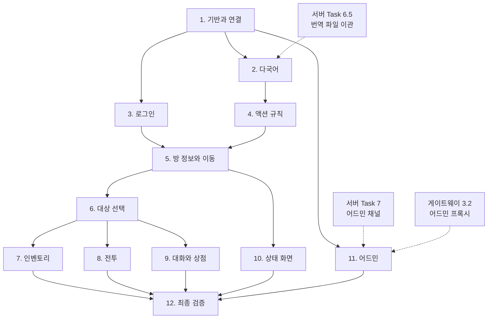

# Implementation Plan

## Overview

Godot 4.x + GDScript로 게임 클라이언트를 구현한다. 프로토콜 계약(`docs/protocol/`, 서버 저장소)이 유일한 접점이므로 서버 구현과 병렬로 진행할 수 있다.

각 단계는 독립 커밋으로 진행한다. 검증은 두 층으로 한다. 서버 없이 가능한 것(번역 치환, 액션 규칙, 메시지 디스패치)은 단위 테스트로, 통신이 필요한 것은 서버 하니스가 동작하는 서버에 붙여 확인한다.

계약의 예시 페이로드를 테스트 픽스처로 재사용해 서버 구현과의 정합성을 함께 확인한다.

## Tasks

- [x] 1. 프로젝트 기반과 연결 계층
- [x] 1.1 Godot 프로젝트 초기화
  - `godot/` 아래 Godot 4.x 프로젝트를 만든다. 디렉터리 구조는 design.md의 배치를 따른다. autoload로 `game_state.gd`와 `translator.gd`를 등록한다.
  - `project.godot` 을 `config_version=5` 로 만들었다. `config/features` 하한은 `4.2` 이고 개발 편집기가 `4.2.2-stable` 이므로 정확히 일치한다. 버전 업그레이드 안내가 뜨지 않는다. 필요한 기능(`WebSocketPeer`, `JSON.parse_string`, `String.format`)은 모두 4.0 에 있어 하한을 더 올릴 이유가 없다.
  - `config/version="0.1.0"` 을 넣었다. Task 1.9 의 `client_info` 가 `ProjectSettings` 에서 이 값을 읽는다.
  - 렌더러를 `gl_compatibility` 로 뒀다. UI 위주 클라이언트이고 웹 내보내기가 WebGL2 를 요구하므로 선택지를 좁히지 않는다.
  - `run/main_scene` 을 비워 뒀다. 첫 씬은 Task 3 의 `scenes/login/login.tscn` 이다. 그때까지 편집기에서 실행하면 씬 선택을 묻는다.
  - 디렉터리는 실제 파일이 들어가는 것만 만들었다. `scripts/net/`, `scripts/rules/`, `scripts/admin/`, `scenes/**` 는 각 담당 작업이 만든다. git 이 빈 디렉터리를 추적하지 않으므로 `.gitkeep` 12개를 넣는 대신 배치는 design.md 에 남긴다.
  - autoload 두 스크립트는 문서 주석만 있는 골격이다. 필드와 신호는 Task 1.7, 번역 로딩과 `t()` 는 Task 2.2 가 채운다. 여기서 등록해 두면 이후 작업이 `project.godot` 을 건드리지 않는다.
  - `godot/.gitignore` 로 `.godot/`(임포트 캐시)와 `export_presets.cfg`(서명 자격 정보)를 제외했다.
  - 검증: `Godot_v4.2.2-stable_win64 --headless --path godot --editor --quit` 로 임포트가 오류 없이 끝났고 편집기가 `project.godot` 을 다시 쓰지 않았다. 설정 키가 모두 유효하다는 뜻이다.
  - 검증: `--headless --script` 로 런타임 확인. autoload 두 개가 root 에 붙고, `ProjectSettings` 에서 `config/version` 이 읽히고, 번역 11개 파일 405개 키가 `JSON.parse_string` 으로 파싱되고, `String.format({"old_name":...})` 이 `{old_name}` 을 치환한다. design.md 가 전제한 문법 호환이 실측으로 확인됐다. 검증 스크립트는 일회용이라 남기지 않았다.
  - 검증: 정적 검사로 LF·UTF-8, 번역 키의 locale dict 구조와 `en` 폴백, Python 포맷 스펙 0건, `{{` 리터럴 0건을 확인했다. Node 쪽 `type-check` 통과, `npm test` 38건 통과(godot/ 는 `tsconfig.server.json` 과 vitest include 밖이다).
  - `.json` 은 Godot 4 에서 임포트 대상이 아니다. `.import` 파일이 생기지 않으므로 `FileAccess` 로 직접 읽는다. Task 2.2 의 로딩 방식이 이것이다.
  - 정적 검사 게이트를 함께 넣었다. Requirement 13 의 품질 기준에 해당하고, 코드가 두 파일뿐인 지금 켜는 비용이 0 이다. 나중에 켜면 누적된 위반을 한꺼번에 고쳐야 한다.
    - `project.godot` `[debug]` 에 경고를 오류로 올렸다. `untyped_declaration`, `unsafe_method_access`, `unsafe_property_access`, `unsafe_cast` 를 2(오류)로, `unsafe_call_argument` 와 `return_value_discarded` 를 1(경고)로 뒀다. 뒤의 둘은 `JSON.parse_string` 결과가 전부 Variant 인 디스패처 경계에서 과도하게 걸릴 항목이라 Task 1.4 구현 후 재검토한다. 4.2.2 에는 `treat_warnings_as_errors` 같은 전역 스위치가 없고 `debug/gdscript/warnings/*` 47개 항목별로 0·1·2 를 지정한다.
    - `scripts/godot-check.sh` 와 npm `check:godot` 을 추가했다.
    - 편집기로 프로젝트를 한 번 열면 `project.godot` 이 다시 쓰이면서 주석이 모두 사라지고 키 순서가 바뀐다. 값은 그대로 남는다. 따라서 설정의 근거를 파일 주석으로 남길 수 없고 이 문서가 유일한 기록이다.
  - GDScript 오류 검출의 실측 결과를 남긴다. 헤드리스 실행의 종료 코드를 게이트로 쓸 수 없다.
    - `_initialize()` 에서 직접 런타임 오류가 나면 그 함수가 중단되어 `quit()` 에 도달하지 못하고 프로세스가 무한 대기한다. 외부 타임아웃이 필요하다.
    - 하위 함수에서 런타임 오류가 나면 그 함수만 중단되고 호출자는 계속 진행한다. `SCRIPT ERROR` 는 출력되지만 종료 코드는 0 이다.
    - `--editor --quit` 은 오류가 0건인 정상 프로젝트에서도 1 을 돌려준다. 종료 코드를 쓸 수 없으므로 출력에서 `SCRIPT ERROR`·`ERROR:` 를 찾는다. 정상 실행의 출력에는 이 두 패턴이 없고 무관한 `WARNING` 두 줄(headless 커서, Blender 경로)만 있다.
    - `--check-only --script` 는 정상 0, 파스·타입 오류 1 로 종료 코드가 신뢰할 수 있는 유일한 경로다. 다만 지정한 파일과 그 의존만 검사하므로 전수 순회가 필요하다.
    - `--editor --quit` 은 아무도 참조하지 않는 `.gd` 까지 전수 파스한다. 검사 스크립트가 두 방식을 모두 쓰는 이유다.
    - 정적 타입을 붙이면 런타임 오류가 파스 오류로 바뀐다. `var n: int = "문자열"` 은 `--check-only` 에서 `Cannot assign a value of type "String" as "int"` 로 잡힌다. 타입을 붙이지 않으면 실행할 때까지 알 수 없다.
    - 부정 검증: 타입 없는 파라미터와 변수, Variant 메서드 호출이 있는 파일을 넣으면 두 층 모두 실패하고 스크립트가 1 로 종료한다.
  - 정적 검사가 덮지 못하는 영역을 기록한다. 씬 배선(`get_node` 오타, `.tscn` 의 끊긴 참조)은 씬을 인스턴스화할 때만 드러난다. 대책은 `%UniqueName` 접근과 타입 붙인 `@onready`, 그리고 씬별 헤드리스 인스턴스화 스모크 테스트다. 동작 검증은 테스트 프레임워크가 필요하며 Task 2.5, 4.3, 12.3 이 이를 요구한다. 프레임워크(gdUnit4 또는 GUT)는 아직 결정하지 않았다.
  - Task 2.1 이 이관한 번역 파일 중 7개(`admin`, `auth`, `combat`, `command`, `item`, `moving`, `npc`)가 CRLF 다. 서버 저장소의 줄바꿈을 그대로 가져온 결과다. JSON 파싱에는 영향이 없어 이 작업에서 손대지 않았다.
  - _Requirements: 1.1, 13.1_
- [x] 1.2 WebSocket 연결 관리
  - `scripts/net/connection.gd`에 `WebSocketPeer` 래퍼를 만든다. 접속, 프레임 송수신, 상태 전이(`DISCONNECTED`, `CONNECTING`, `WAITING_WELCOME`, `READY`)를 구현한다. `welcome` 수신 전에는 송신하지 않는다.
  - 접속 대상 호스트와 포트를 설정으로 변경할 수 있게 한다.
  - 상태 전이는 `_process` 의 `WebSocketPeer.poll()` 결과로 판정한다. `STATE_OPEN` 이면서 `CONNECTING` 이면 `WAITING_WELCOME` 으로, `welcome` 검증을 통과하면 `READY` 로 간다.
  - `send()` 는 `READY` 가 아니면 거부하고 경고를 남긴다. 계약의 "welcome 전에는 어떤 메시지도 보내지 않는다" 를 한 곳에서 강제한다.
  - 재연결마다 `WebSocketPeer` 를 새로 만든다. 닫힌 peer 를 재사용하지 않는다.
  - 접속 설정은 `scripts/net/client_config.gd` 가 `user://client.cfg` 로 읽고 쓴다. 편집기 없이 접속 대상을 바꿀 수 있어야 하므로 `ProjectSettings` 가 아니라 쓰기 가능한 위치를 쓴다. 파일이 없으면 기본값(`localhost:3000`)으로 만든다.
  - _Requirements: 1.2, 1.9, 1.11_
- [x] 1.3 재연결과 유휴 유지
  - 연결이 끊기면 지수 백오프(1초 시작, 2배씩, 30초 상한)로 재시도한다. 사용자가 취소할 수 있게 한다. 60초 이상 송신이 없으면 `ping`을 보낸다.
  - 의도적 종료(사용자 취소, 프로토콜 위반)와 사고 종료를 `_intentional` 로 구분한다. 앞의 경우 재연결하지 않는다.
  - 유휴 타이머는 송신할 때마다 0 으로 되돌린다. `ping` 자신도 송신이므로 다음 60초를 다시 센다.
  - _Requirements: 1.7, 1.8_
- [x] 1.4 메시지 디스패처
  - `scripts/net/dispatcher.gd`가 수신 프레임을 JSON 파싱하고 `type`별로 분기한다. 계약에 없는 `type`은 무시하고 경고를 기록한다. 파싱 실패도 같이 처리한다.
  - `scripts/net/protocol.gd`에 타입 상수와 거절 코드 상수를 정의한다.
  - 거부 지점이 넷이다. 파싱 실패, 최상위가 오브젝트가 아님, `type` 없음, 계약에 없는 `type`. 넷 모두 경고만 남기고 연결을 유지한다.
  - `protocol.gd` 에 `as_dict`·`as_array`·`as_string`·`as_int`·`as_bool` 을 뒀다. `JSON.parse_string` 결과가 Variant 이므로 상태 저장소로 넘기기 전에 이곳에서 형을 확정한다. 서버가 계약을 어겨도 클라이언트가 죽지 않는다. 엄격 타입 설정에서 Variant 멤버 접근이 오류이므로 이 경계 함수가 없으면 코드가 컴파일되지 않는다.
  - `seq` 를 가진 모든 응답에 `response_received` 를 발신한다. 액션 송신 측이 이것으로 대기 항목을 해소한다.
  - `INSUFFICIENT_QUANTITY` 는 계약에만 있고 서버가 보내지 않는 코드다(서버 `docs/protocol/consistency.md`). 상수에는 포함했다.
  - _Requirements: 1.3, 1.4_
- [x] 1.5 액션 송신과 seq 관리
  - `scripts/net/action_sender.gd`가 `seq`를 1부터 증가시켜 부여하고 발신 시각과 verb를 기록한다. 응답 대응과 10초 타임아웃 판정을 구현한다. 응답 수신까지 해당 버튼을 비활성화한다.
  - `seq` 채번은 `Connection` 이 소유한다. 연결마다 1 로 초기화되어야 하고 `client_info` 처럼 액션이 아닌 요청도 같은 수열을 쓰기 때문이다.
  - 버튼 비활성화는 `request_sent`·`request_settled`·`request_timed_out` 세 신호로 화면에 위임한다. 송신 계층이 노드를 직접 만지지 않는다.
  - `send_request(type, fields, label)` 을 두고 `send_action` 을 그 위에 얹었다. Task 3 의 `login` 도 같은 seq 대응이 필요하다.
  - 연결이 끊기면 `clear_pending()` 이 대기 항목을 전부 타임아웃으로 처리한다. 응답이 올 수 없는데 버튼이 잠긴 채 남는 것을 막는다.
  - _Requirements: 1.5, 6.8_
- [x] 1.6 프로토콜 버전 확인
  - `welcome`의 `protocol_version`이 지원 범위를 벗어나면 클라이언트 업데이트를 안내하고 연결을 종료한다.
  - 같은 자리에서 `welcome.channel` 도 확인한다. 계약이 "기대한 채널이 아니면 연결을 끊고 접속 설정 오류를 알린다" 를 요구한다. 두 채널은 프레이밍이 같고 포트만 달라 확인이 없으면 조용히 실패한다.
  - 둘 다 의도적 종료로 처리해 재연결하지 않는다. 재시도해도 같은 결과이기 때문이다.
  - _Requirements: 1.10_
- [x] 1.7 상태 저장소
  - `scripts/state/game_state.gd`에 player, room, entities, nearby_rooms, inventory, equipped, combat, dialogue, shop, chat_log, event_log, connection_status를 둔다. 변경을 신호로 전파한다. `entities`는 uuid 키 딕셔너리로 관리한다. 로그는 최근 500건으로 제한한다.
  - `class_name GameStateStore` 를 붙였다. autoload 이름 `GameState` 와 같은 이름은 Godot 이 금지한다. 다른 스크립트는 autoload 식별자를 직접 쓰지 않고 이 타입으로 주입받는다. autoload 식별자가 `--check-only` 단일 파일 검사에서 해석되지 않기 때문이며, 주입은 서버 없이 상태 반영을 검증하는 Task 12.3 의 전제이기도 하다. autoload 를 직접 참조하는 곳은 조립 지점인 `scenes/boot/boot.gd` 뿐이다.
  - `entity_update` 대상이 사본에 없으면 `resync_required` 를 발신한다. 상태 저장소가 직접 `look` 을 보내지 않는다. 송신 수단을 아는 조립 지점이 처리한다.
  - `login_result.admin_channel` 을 별도 필드로 보관한다. `is_admin` 만으로는 어드민 진입 가능 여부를 알 수 없고 `available` 이 참일 때만 버튼을 노출한다는 계약 때문이다.
  - `dialogue` 는 `is_active` 가 거짓이면 비운다. 화면이 매번 판정하지 않게 한다.
  - _Requirements: 13.1, 13.2_
- [x] 1.8 연결 상태 표시
  - 연결 중, 연결됨, 끊김, 재연결 시도를 화면에 표시한다.
  - `scenes/common/connection_indicator.tscn` 은 재사용 부품이다. 재연결 대기 중에는 남은 초와 시도 횟수를 세고 취소 버튼을 띄운다. 취소하면 버튼이 재시도로 바뀐다.
  - `scenes/boot/boot.tscn` 을 조립 지점이자 임시 첫 씬으로 만들었다. 연결·디스패처·액션 송신·상태 저장소를 엮는 유일한 곳이다. Task 3 이 로그인 화면을 얹으면 이 씬이 화면 전환의 뿌리가 된다.
  - 상태 4종은 계약이 정의한 연결 전이이고 재연결 대기는 그중 하나가 아니다. 그래서 상태를 5개로 늘리지 않고 `reconnect_scheduled`·`reconnect_cancelled` 신호로 분리했다.
  - 표시 문구는 아직 영어 하드코딩이다. Translator 가 없어서이며 Task 2.3 에서 번역을 거치게 한다.
  - _Requirements: 1.6_
- [x] 1.9 클라이언트 정보 통지
  - 접속 후 `client_info`로 클라이언트 버전, 플랫폼, Locale을 통지한다. 응답을 기다리지 않는 단방향 통지다.
  - `Connection` 이 `READY` 로 전이하는 자리에서 자동으로 보낸다. 화면이 잊을 수 없게 하려는 것이다. 응답이 없으므로 대기 목록에 넣지 않는다.
  - `client_version` 은 `ProjectSettings` 의 `application/config/version`, `platform` 은 `OS.get_name().to_lower()`, `locale` 은 접속 설정 값이다.
  - _Requirements: 1.12_

### Task 1 통합 검증 (2026-08-11)

Godot → 게이트웨이 → 대역 서버로 실제 사슬을 세워 확인했다. 대역 서버는 계약대로 `welcome` 을 보내고 `ping` 에 `pong` 으로 답하는 최소 TCP 라인 서버다. 게이트웨이는 저장소의 실제 구현을 그대로 띄웠다.

| 확인 항목 | 결과 |
|---|---|
| 상태 전이 | CONNECTING → WAITING_WELCOME → READY |
| `client_info` | `{"client_version":"0.1.0","locale":"ko","platform":"windows","seq":1}` |
| `ping` 주기 | `client_info` 후 정확히 60초에 `seq:2` 로 발신, `pong` 수신 |
| 재연결 백오프 | 상위 서버를 죽이자 1, 2, 4, 8초 간격으로 재시도 |
| `protocol_version: 99` | 1000 `unsupported protocol version` 으로 종료, 재연결 없음 |
| `channel: admin` | 1000 `channel mismatch` 로 종료, 재연결 없음 |
| 용량 초과 | 1008 `Server at capacity` 수신 후 백오프 재시도 |
| 파싱 실패 `this is not json` | 경고 후 무시, 연결 유지 |
| 최상위 배열 `[1,2,3]` | 경고 후 무시, 연결 유지 |
| `type` 없음 `{"seq":9}` | 경고 후 무시, 연결 유지 |
| 계약에 없는 `future_message` | 경고 후 무시, 연결 유지 |

검증 중 드러난 사실 셋을 남긴다.

첫째, 게이트웨이가 계약에 없는 프레임 두 종을 보낸다. 접속 직후의 `{"type":"gateway_connected","timestamp":...}` 와 거부 시의 `{"type":"gateway_error","reason":...,"timestamp":...}` 다. `docs/protocol/` 어디에도 정의가 없다. 처음에는 클라이언트가 접속할 때마다 "계약에 없는 type" 경고를 냈다. `protocol.gd` 에 `GATEWAY_TYPES` 를 두어 별도로 다루도록 고쳤다. `gateway_error` 는 무시하면 사용자가 거부 원인을 알 수 없으므로 화면에 표시한다. 계약 문서에 이 두 프레임을 추가할지는 게이트웨이 쪽 결정 사항이다.

둘째, 용량 초과에서는 `gateway_error` 프레임이 클라이언트에 도달하지 않는다. 게이트웨이가 프레임을 보낸 직후 1008 로 닫아 경합에서 종료가 이긴다. 실제로 클라이언트가 원인을 아는 경로는 종료 코드 1008 과 사유 문자열이다. `gateway_error` 처리는 연결이 유지되는 경우(프레임 규약 위반)를 위해 남긴다.

셋째, Godot 의 로그 파일 회전 규칙이다. `user://logs/godot.log` 가 현재 실행이고 타임스탬프가 붙은 파일은 회전된 이전 실행이다. 최신 타임스탬프 파일을 읽으면 한 번 전 실행을 보게 된다.

- [x] 2. 다국어 처리
- [x] 2.1 번역 파일 이관
  - 서버의 `data/translations/` 9개 파일을 `godot/resources/translations/`로 옮긴다. Python `str.format` 포맷 스펙(`{value:>10}`, `{value!r}`)과 리터럴 중괄호(`{{`)가 있는 값을 전수 확인해 GDScript 호환 형태로 정리한다.
  - 선행 조건: 서버 `server-json-protocol` Task 6.5(번역 파일 이관 시점). 서버가 추가한 새 키 목록을 함께 받는다.
  - 커밋 `d1cbbc9`. 이관 9개 + 신규 2개(`account.json`, `social.json`) = 11개 파일. 포맷 스펙과 `{{` 리터럴은 전수 검사 결과 0건이므로 값 변환 없이 그대로 옮겼다. Godot 프로젝트가 아직 없어 리소스만 배치한 상태이며 `2.2 Translator` 에서 실제로 읽는다.
  - _Requirements: 3.1, 3.4_
- [x] 2.2 Translator 구현
  - `scripts/i18n/translator.gd`에 `t(key, params)`를 구현한다. GDScript `String.format`이 딕셔너리 키를 `{name}` 자리표시자로 지원하므로 문법 변환 없이 사용한다. `params` 값이 언어별 dict면 현재 locale 값을 고르고 스칼라면 그대로 치환한다.
  - 키가 없으면 키 문자열을 반환하고 경고를 기록한다. 현재 locale 번역이 없으면 `en`으로 폴백한다.
  - `class_name TranslatorService`. autoload 이름 `Translator` 와 같은 이름은 Godot 이 금지한다. `GameStateStore` 와 같은 이유이고 주입 방식도 같다.
  - `load_translations()` 를 `_ready` 와 분리했다. 테스트가 씬 트리 없이 `TranslatorService.new()` 로 만들어 직접 부른다.
  - `render(message)` 를 추가했다. `{"key": ..., "params": ...}` 형태가 `event`, `login_result.message`, 대화 대사에 공통이라 Task 5.9 와 9.1 이 그대로 쓴다.
  - 클라이언트 UI 문구는 `resources/translations/ui.json` 에 새로 뒀다. 서버에서 이관한 11개 파일은 게임 콘텐츠이고 UI 문구는 클라이언트 소유다. 키가 겹치면 경고를 남긴다.
  - _Requirements: 3.2, 3.3, 3.5, 3.6_
- [x] 2.3 Locale 전환
  - Locale 전환 UI를 제공하고 선택을 로컬에 저장한다. 전환 시 화면을 다시 그리며 재접속을 요구하지 않는다.
  - `scenes/common/locale_selector.tscn` 을 만들고 `boot.tscn` 상단 줄에 연결 표시와 나란히 뒀다. 선택은 `user://client.cfg` 에 저장된다.
  - 언어 이름 목록만은 번역하지 않는다. 현재 locale 이 무엇이든 자기 언어를 알아볼 수 있어야 한다.
  - 화면은 문구를 문자열이 아니라 키와 params 로 들고 있다가 `locale_changed` 에 다시 그린다. 표시 문자열만 갖고 있으면 다시 그릴 수 없다. 연결 표시의 재연결 카운트다운, 로그인 화면의 안내, 조립 지점의 알림이 모두 이 방식이다.
  - Task 1.8 과 3 이 하드코딩했던 문구를 모두 키로 옮겼다.
  - _Requirements: 3.8, 3.9_
- [x] 2.4 엔티티 이름 선택과 조사 처리
  - 서버가 보낸 언어별 dict에서 현재 locale 값을 선택하는 공통 함수를 제공한다. 한국어 조사는 번역 값의 완성형(`{item}을(를)`)을 그대로 표시한다. 채팅 본문은 번역하지 않는다.
  - 공통 함수는 `Translator.pick(value)` 다. 엔티티 이름과 설명, 방 설명, `params` 안의 언어별 dict 가 모두 같은 형태이므로 하나로 처리한다. 스칼라와 `null` 도 받아 문자열로 돌려준다. 서버가 지원하는 언어가 클라이언트보다 적으면 `en` 으로 떨어진다.
  - 조사는 종성 판별을 하지 않는다. 번역 값이 `{item}을(를)` 완성형을 담고 그대로 표시한다. 향후 개선 지점이며 테스트로 이 동작을 고정했다.
  - 채팅 본문은 `chat` 메시지의 `message` 필드를 그대로 쓴다. 번역 경로를 타지 않는다. 실제 표시는 Task 5.7 이다.
  - _Requirements: 3.7, 3.10, 3.11_
- [x] 2.5 번역 단위 테스트
  - 키와 params 조합으로 기대 문자열을 검증한다. 언어별 dict params, 키 없음 폴백, locale 폴백을 포함한다.
  - 테스트 프레임워크를 여기서 정했다. gdUnit4 와 GUT 는 저장소 밖에서 내려받아 `addons/` 에 넣어야 하는데 이 환경에서 받을 수 없었다. 그리고 지금 필요한 검증(번역 치환, 액션 규칙, 메시지 디스패치)은 씬 트리도 목(mock)도 필요 없는 순수 로직이다. `tests/test_case.gd`(단언)와 `tests/runner.gd`(탐색과 실행) 두 파일로 충분하다. 목이나 매개변수화 테스트가 필요해지면 다시 판단한다.
  - `npm run test:godot` 으로 돌린다. 러너는 `--script` 경로라 종료 코드가 신뢰할 수 있다. 그래도 외부 타임아웃을 건다. 런타임 오류가 나면 `quit()` 에 닿지 못해 프로세스가 멈추기 때문이다.
  - 18건. 리소스 적재, 키 치환, locale 전환, 지원하지 않는 locale 거부, params 치환, 언어별 dict params 를 양쪽 locale 에서, 키 없음 폴백, locale 폴백, `pick` 세 경우, `render` 두 경우, 조사 완성형, 서버 리소스 키 적재.
  - 계약 문서의 오류를 하나 찾았다. `server-to-client.md` 의 `event` 예시가 쓰는 `combat.damage_dealt` 는 존재하지 않는 키다. 실제 서버가 보내는 것은 `combat.hit`, `combat.critical_hit`, `combat.attack_swing` 이다. 테스트는 실제 키로 썼다.
  - _Requirements: 13.5_

- [x] 3. 로그인과 로그아웃
  - `scenes/login/login.tscn`을 만든다. 사용자명과 비밀번호 입력, `login` 메시지 송신, `reason_code`별 안내 표시를 구현한다. 회원가입 기능을 제공하지 않고 랜딩 사이트 링크만 표시한다. 자동 로그인 옵션을 제공하며 자격 정보를 평문으로 보관하지 않는다. 로그아웃은 `logout` 송신 후 로그인 화면으로 전환하고 연결을 유지한다. `is_admin`이 참일 때만 어드민 진입 버튼을 노출한다. `room_info`, `player_state`, `inventory`를 모두 받은 뒤 게임 화면을 표시한다.
  - 만든 것은 `scenes/login/`(폼), `scenes/main/`(게임 화면 자리), `scripts/auth/credential_store.gd` 다. `scenes/boot/boot.tscn` 이 두 화면을 담는 그릇이 됐다.
  - `scenes/main/` 을 지금 만든 이유는 로그아웃 버튼과 어드민 진입 버튼이 갈 곳이 필요해서다. 버릴 임시 씬을 따로 만드는 대신 Task 5.1 이 채울 파일을 미리 열었다. 지금은 플레이어 요약과 좌표, 버튼 둘만 있다.
  - 요구사항 4.7 과 계약이 어긋난다. 요구사항은 `is_admin` 이 참일 때 어드민 버튼을 노출하라고 하지만, 계약(`docs/protocol/server-to-client.md`)은 `admin_channel.available` 이 참일 때만 노출하라고 한다. 권한이 있어도 어드민 포트를 열지 않은 배포가 있기 때문이다. 계약을 따랐다. 요구사항 문서가 서버 Task 7.1 이전에 쓰였다.
  - 자격 정보는 `FileAccess.open_encrypted_with_pass` 로 암호화해 `user://credentials.dat` 에 둔다. 열쇠는 설치마다 무작위로 만들어 `user://install.key` 에 둔다. 이것이 막는 것과 못 막는 것을 분명히 해 둔다. 파일을 눈으로 열어 보는 수준과 백업·동기화 폴더로 자격 정보가 흘러가는 것은 막는다. 같은 사용자 권한으로 로컬 파일에 접근하는 공격자는 열쇠 파일도 읽으므로 막지 못한다. 그 수준은 OS 키체인이 필요하고 Godot 이 접근 수단을 주지 않는다.
  - 로그인 실패 시 저장된 자격을 지우고 자동 로그인을 끈다. 틀린 자격으로 재접속마다 실패를 반복하는 고리를 만들지 않는다.
  - 거절 사유 문구는 화면이 자체 보유한다. 서버가 `message.key` 를 함께 보내지만 실패 사유가 셋뿐이고 화면 맥락에 맞는 안내가 필요하다. Task 11.1 의 어드민 패널도 같은 방식이다. Task 2.3 에서 Translator 를 거치게 한다.
  - 스냅샷 셋을 세는 것은 `GameStateStore.snapshot_received` 신호다. `player_changed` 는 `login_result` 에서도 발신되어 `player_state` 도착과 구별되지 않는다.
  - _Requirements: 4.1, 4.2, 4.3, 4.4, 4.5, 4.6, 4.7, 4.8_

### Task 3 통합 검증 (2026-08-11)

실제 MUD 서버(`Echoes-of-the-Fallen-Age`)와 게이트웨이를 띄우고 확인했다. 헤드리스에서는 버튼을 누를 수 없어 임시 프로브 씬으로 눌렀고 검증 후 삭제했다. 계정은 검증용으로 만든 `godottest` 다.

| 확인 항목 | 결과 |
|---|---|
| 자동 로그인 | 암호화 저장 → 재기동 후 복원 → `READY` 직후 자동 송신 |
| 로그인 성공 | `login_result` 성공 후 `room_info`·`player_state`·`inventory` 셋을 받고 게임 화면 진입 |
| 로그인 실패 | 틀린 비밀번호로 `INVALID_CREDENTIALS`, 로그인 화면 유지, 자동 로그인 해제 |
| 로그아웃 | `logout_result` 후 로그인 화면 전환, 연결은 `READY` 유지 |
| 재로그인 | 같은 연결에서 다시 로그인해 게임 화면 재진입 |
| 어드민 버튼 | `admin_channel.available` 이 참이면 노출, 거짓이면 숨김 |

이 검증이 서버 결함 넷을 드러냈다. 넷 모두 계약 위반이라 서버 저장소에서 고쳤다.

| 결함 | 계약 | 고친 곳 |
|---|---|---|
| 로그인 후 `room_info` 만 보내고 `player_state`·`inventory` 를 보내지 않음 | README 연결 수명주기 4항 | `telnet_server._send_login_snapshots` |
| `logout` 이 연결을 닫음 | client-to-server.md logout | `telnet_server._handle_logout`, `TelnetSession.deauthenticate` |
| 인증 루프에 `login` 분기가 없어 재로그인 불가 | 로그아웃 후 다른 계정 접속 | `telnet_server._handle_authenticated_message` |
| 같은 연결의 재로그인을 중복 로그인으로 판정해 자기 자신을 끊음 | — | `handle_login` 의 자기 세션 제외 |

`client_info` 로그가 없는 필드(`client`)를 읽어 항상 `None` 을 찍던 것도 함께 고쳤다. 계약의 필드는 `client_version`, `platform`, `locale` 이다.

- [x] 4. 액션 규칙 테이블
- [x] 4.1 규칙 구현
  - `scripts/rules/action_rules.gd`에 design.md의 규칙 표를 구현한다. 몬스터(방), 오브젝트(방), 오브젝트(인벤토리), 플레이어(방), 전투 중 각각의 조건별 동사 목록을 반환한다. 서버가 보낸 속성만 판단 근거로 사용한다.
  - 전부 정적 함수다. 상태가 없고 입력이 곧 출력이라 인스턴스를 만들 이유가 없다. 이 성질이 테스트를 단순하게 만든다.
  - 엔티티 밖의 조건은 `context` 딕셔너리로 받는다. `has_inventory_items`(플레이어에게 `give`), `has_other_players`(아이템을 `give`), `shop_open` 과 `shop_sell_prices`(`shop_sell`)다. 매도가가 아이템 엔티티에 없는 것은 가격이 `item_prices` 테이블의 템플릿 단위 값이고 실물 아이템의 속성이 아니기 때문이다.
  - 귓속말은 동사 목록에 넣지 않았다. design.md 의 플레이어 표에 있지만 `chat` 메시지의 채널이지 `action` 의 verb 가 아니다. 대상 선택은 채팅 UI 가 맡는다(Task 5.7).
  - `talk` 은 `can_talk` 과 무관하게 항상 표시한다. 서버가 스크립트 없는 대상에게도 침묵 응답을 준다.
  - 전투 표의 둘째 줄(`flee`, `use_item`, `end_turn`)은 대상이 없으므로 `combat_bar(is_my_turn)` 으로 분리했다. `for_combatant` 은 대상이 있는 `attack` 만 다룬다.
  - _Requirements: 6.1, 6.2, 6.3_
- [x] 4.2 거절 응답 처리
  - Rejection_Code별 처리를 구현한다. `NOT_APPLICABLE`은 버튼 제거만 하고 오류로 표시하지 않는다. `NOT_FOUND`는 `look`으로 재동기화, `NOT_AUTHENTICATED`는 로그인 화면 전환이다. 나머지는 design.md의 표를 따른다.
  - `scripts/rules/rejection_policy.gd` 가 무엇을 할지만 정하고 실행은 조립 지점이 한다. 규칙과 실행을 나눠야 서버 없이 표를 검증할 수 있다.
  - 모르는 코드는 안내를 표시한다. 조용히 삼키면 원인을 알 수 없다. 서버가 새 코드를 쓰기 시작해도 사용자가 무언가 거절됐다는 것은 안다.
  - 버튼 제거는 대상을 아는 화면의 몫이라 지금은 아무것도 하지 않는다. Task 5·6 이 엔티티 버튼을 만들면 채운다.
  - `NOT_AUTHENTICATED` 안내로 처음에 `ui.login.not_connected` 를 썼는데 연결은 살아 있고 서버 세션만 사라진 상황이라 문구가 틀렸다. `ui.login.session_expired` 를 새로 뒀다.
  - _Requirements: 6.4, 6.5, 6.6, 6.7_
- [x] 4.3 규칙 단위 테스트
  - 엔티티 속성 조합을 넣어 기대 버튼 목록을 검증한다.
  - `test_action_rules.gd` 25건, `test_rejection_policy.gd` 11건. 번역 18건과 합쳐 54건이다.
  - 거절 표는 두 가지를 함께 고정했다. 계약의 코드 15종이 모두 표에 있는지, 그리고 사용자에게 보이는 코드마다 번역 키가 실제로 있는지다. 뒤의 것은 `Translator` 를 함께 써서 확인한다. 코드가 늘 때 문구를 빠뜨리면 테스트가 잡는다.
  - _Requirements: 13.5_

### Task 4 통합 검증 (2026-08-11)

거절 처리는 대역 서버가 `action_rejected` 를 자발적으로 보내게 해 확인했다. 실제 서버로는 특정 코드를 원하는 대로 만들 수 없다.

| 코드 | 기대 | 결과 |
|---|---|---|
| `NOT_FOUND` | `look` 재요청 | 서버가 `{"seq":3,"type":"action","verb":"look"}` 을 받았다 |
| `NOT_APPLICABLE` | 조용히 무시 | 송신 없음, 경고 없음, 안내 없음 |
| `PERMISSION_DENIED` | 안내 표시 | 게임 화면 유지, "그 동작을 수행할 권한이 없습니다." |
| `NOT_AUTHENTICATED` | 로그인 전환 | 로그인 화면 전환, 연결은 "연결됨" 유지 |
| `INVALID_PARAMS` | 로그만 | "클라이언트 버그: attack 가 INVALID_PARAMS 로 거절됐습니다" |

- [x] 5. 방 정보와 이동
- [x] 5.1 방 표시
  - `scenes/main/main.tscn`에 방 설명, 시간대, 좌표를 표시한다. 방 이름을 표시하지 않는다. `rooms` 테이블에 이름 컬럼이 없다.
  - Task 3 이 자리만 잡아 둔 `main.tscn` 을 실제 화면으로 채웠다. 머리글(플레이어·종족·로그아웃·어드민), 상태 줄(시간대·좌표), 본문(설명·엔티티 구역 / 미니맵·출구)이다.
  - 좌표는 지형 아이콘과 함께 표시한다. 방 이름이 없으므로 위치를 알릴 유일한 수단이다.
  - _Requirements: 5.1, 5.2_
- [x] 5.2 출구와 진입 버튼
  - 이동 가능한 출구를 버튼으로, 막힌 출구를 비활성 상태로 표시한다. `move` verb에 `direction` params를 담아 전송한다.
  - `room.has_passage`가 참이면 진입 버튼을 표시하고 `enter` verb를 전송한다. `enter`는 `room_connections` 기반이므로 target이 없다.
  - 세 상태로 나눴다. `exits` 에 있으면 활성, `blocked_exits` 에 있으면 비활성, 둘 다 아니면 숨긴다. 벽만 있는 방향까지 비활성으로 늘어놓으면 막힌 문과 구별되지 않는다.
  - 이동 중 버튼 잠금의 완료 신호로 `room_changed` 를 쓴다. 성공한 액션에는 `seq` 가 실려 오지 않아 `ActionSender` 의 응답 대응이 성공 경로에서 동작하지 않기 때문이다. 거절과 무응답은 `request_settled`·`request_timed_out` 이 풀어 준다. 상세는 아래 검증 기록에 있다.
  - _Requirements: 5.3, 2.3_
- [x] 5.3 엔티티 버튼 렌더링
  - `scenes/main/entity_button.tscn`을 만들고 방 엔티티를 버튼으로 표시한다. `disposition`에 따라 인물(friendly), 동물(neutral), 적(hostile) 구역으로 나눈다. 오브젝트는 스택 수량을 함께 표시한다. 화면을 넘칠 경우 구역별 스크롤을 적용한다.
  - 구역을 `scenes/main/entity_zone.tscn` 으로 분리했다. 넷이 같은 구조라 `main.tscn` 에 네 번 펼치면 동기화 부담이 생긴다. 각 구역이 자기 스크롤을 갖고 엔티티가 없으면 구역째 숨는다.
  - 플레이어는 인물 구역에 넣는다. `disposition` 이 없는 종류라 구역 분류에서 기본값으로 떨어진다.
  - 아이콘은 몬스터는 `disposition`, 오브젝트는 `category` 로 고른다. `stack_count` 가 1을 넘으면 화폐이므로 💰 로 바꾼다. 현재 이 키를 쓰는 것이 화폐뿐이다.
  - uuid 를 버튼에 노출하지 않는다. 이름이 비어 있을 때만 마지막 수단으로 쓴다.
  - _Requirements: 5.4, 5.5, 5.8, 2.1_
- [x] 5.4 미니맵
  - `scenes/main/minimap.tscn`에서 `nearby_rooms` 좌표 배열로 미니맵을 렌더링한다. 북쪽이 y 증가 방향이므로 화면 y축을 반전한다. 현재 위치는 `room.x`, `room.y` 비교로 판별한다.
  - 격자 크기를 `nearby_rooms` 와 현재 좌표의 경계에서 계산한다. 반경 2를 가정하지 않는다. 서버가 범위를 바꿔도 그대로 그린다.
  - 현재 방이 `nearby_rooms` 에 포함되는지에 의존하지 않는다. 현재 좌표를 별도로 받아 비교한다.
  - 좌표가 빠진 칸은 `·` 로 남긴다. 서버가 보내지 않은 방과 지형을 모르는 방을 구별한다.
  - _Requirements: 5.6, 5.11_
- [x] 5.5 지형 매핑
  - `scripts/rules/terrain.gd`에 22종 지형의 아이콘과 색상을 매핑한다. 목록에 없는 값은 `unknown`으로 처리한다.
  - 색상은 hex 문자열로 두고 `Color.html()` 로 만든다. `const` 안에서 `Color` 를 만들 수 없다.
  - `hedge` 가 `grassland` 와 같은 아이콘인 것은 design.md 의 표를 따른 것이다.
  - 현재 데이터베이스의 방 520개가 모두 `room_type = 'unknown'` 이다. 컬럼은 있으나 채워지지 않았고 서버가 값을 넣는 경로는 어드민 `create_room` 뿐이다. 따라서 이 매핑은 당분간 전부 `unknown` 으로 그려진다. 클라이언트 문제가 아니며 데이터가 채워지면 그대로 동작한다. 실제 서버 검증에서도 `❓ unknown (0, 0)` 으로 나왔다.
  - _Requirements: 5.7_
### Task 5.1~5.5 통합 검증 (2026-08-13)

실제 서버와 대역 서버를 나눠 썼다. 실제 서버로는 로그인부터 이동까지 전체 흐름을, 대역 서버로는 구역 분류와 미니맵처럼 특정 데이터가 필요한 것을 확인했다.

실제 서버:

| 항목 | 결과 |
|---|---|
| 머리글 | `godottest (godottest)  ash_knights` |
| 시간대 | `🌙 밤` |
| 좌표 | `❓ unknown (0, 0)` |
| 방 설명 | 한국어 설명이 표시됨 |
| 출구 | 북·남·동·서 활성, 진입 숨김(`has_passage` 거짓) |
| 이동 | 북쪽 버튼을 눌러 `(0, 0)` → `(0, 1)`, 설명이 새 방으로 바뀜 |

대역 서버(엔티티 7종과 주변 방 4개를 담은 `room_info`):

| 항목 | 결과 |
|---|---|
| 인물 | `👤 마을 상인`, `🧍 나그네` |
| 동물 | `🐾 작은 쥐` |
| 적 | `⚔ 재의 약탈자` |
| 물건 | `📦 나무 상자`, `💰 은화 ×15`, `🗡 녹슨 검` |
| 미니맵 | 3열. `· 🌲 ·` / `💧 📍 🏰` / `· 🛤️ ·`. y=8 이 위, y=6 이 아래 |
| 출구 | 북 활성, 서 비활성(`blocked_exits`), 동·남 숨김 |
| 대상 선택 | `마을 상인 선택 — 가능한 동작: examine, attack, talk, shop_open` |

성공한 액션에 `seq` 가 실려 오지 않는 것을 확인했다. 계약은 "서버는 그 요청에 대한 응답과 거절에 같은 값을 되돌려준다" 이고 `room_info` 의 `seq` 도 "클라이언트 요청에 대한 응답이면 요청의 seq" 로 규정한다. 그러나 구현은 성공 시 `success()` 만 돌려주고 방 정보는 이동 매니저가 `seq` 없이 밀어 보낸다. 결과적으로 `ActionSender` 의 대기 항목이 성공 경로에서 해소되지 않고 10초 뒤 타임아웃으로 풀린다.

이동에 대해서는 `room_changed` 를 완료 신호로 써서 서버를 고치지 않고 해결했다. 새 방 정보가 도착한 것이 곧 이동 성공이다. 다만 `get`, `drop`, `equip` 같은 다른 상태 변경 verb 도 같은 성질이라 Task 7 에서 같은 판단이 필요하다. 서버가 밀어 보내는 스냅샷에 요청 `seq` 를 실을지는 미결정이며 `docs/phase2-handover.md` 에 기록했다.

대역 서버 프로브가 `buttons[0] as Button` 에서 걸렸다. 임시 검증 스크립트조차 `unsafe_cast` 승격에 잡힌다. 타입 붙인 배열로 고쳤다.

- [x] 5.6 부분 갱신
  - `entity_enter`, `entity_leave`, `entity_update`로 방 상태를 부분 갱신한다. `entity_update` 대상이 사본에 없으면 `look` verb로 전체를 재요청한다.
  - 병합 자체는 Task 1.7 의 상태 저장소가 이미 하고 있었다. 이 작업에서 한 것은 화면이 그 변화를 반영하는지 확인한 것이다.
  - 재요청은 상태 저장소가 직접 보내지 않는다. `resync_required` 를 발신하고 송신 수단을 아는 조립 지점이 `look` 을 보낸다.
  - 버튼은 변화마다 전부 다시 만든다. 개별 버튼을 갱신하면 선택 상태를 유지할 수 있으나 선택 UI 가 Task 6 에 있어 지금은 유지할 상태가 없다.
  - _Requirements: 5.9, 5.10_
- [x] 5.7 채팅
  - 채팅 입력 수단과 채널 선택(`room`, `whisper`)을 제공하고 `chat` 메시지로 전송한다. 귓속말은 수신 플레이어의 Entity_UUID를 `to`에 담는다. 수신한 `chat`을 채널별로 구분해 표시하며 본문은 번역하지 않는다. 이곳이 자유 문자 입력이 허용되는 지점이다.
  - 입력 상한을 500자로 뒀다. 계약이 정한 값이며 서버가 거절하기 전에 막는다.
  - 귓속말 대상 목록은 같은 방의 플레이어와 `who_result` 로 알게 된 플레이어를 합친다. 자신은 제외한다. `room` 채널일 때는 대상 선택을 숨긴다.
  - 로그의 `RichTextLabel` 에서 BBCode 를 켜지 않았다. 채팅 본문이 사용자 입력이므로 BBCode 를 해석하면 다른 플레이어가 태그를 심을 수 있다. 검증에서 `[b]태그[/b]` 가 그대로 표시되는 것을 확인했다.
  - _Requirements: 5.12, 5.13, 5.14, 2.4_
- [x] 5.8 접속자 목록
  - `who`와 `players_here` verb로 목록을 조회하고 `who_result`를 표시한다. 이 목록에서 귓속말 대상 Entity_UUID를 확보한다. 서버가 좌표를 포함하지 않음을 전제한다.
  - `scenes/main/player_list.tscn` 이 목록을 띄우고 행마다 귓속말 버튼을 둔다. 누르면 채팅 채널이 귓속말로 바뀌고 대상이 선택된다. uuid 는 화면에 적지 않는다.
  - 두 verb 의 응답 타입이 같으므로(`who_result`) 화면은 구분하지 않는다. 범위 차이는 서버가 정한다.
  - _Requirements: 5.15_
- [x] 5.9 이벤트 로그
  - 수신한 `event`를 번역해 로그에 누적하고 `category`(combat, movement, item, social, system, dialogue)로 채널을 분류한다. 로그 상한은 최근 500건이다.
  - 이벤트는 문장이 아니라 키와 params 로 보관한다. locale 이 바뀌면 같은 로그가 다른 언어로 다시 그려진다. 문장으로 저장하면 다시 그릴 수 없다.
  - 필터는 전체와 채팅에 계약의 category 6종을 더해 8개다. 테스트가 계약의 category 를 모두 덮는지 확인한다.
  - 채팅과 이벤트를 한 로그에 섞어 시간 순서를 유지한다. 상태 저장소는 둘을 나눠 보관하므로 그쪽에서 재구성하면 순서를 잃는다.
  - 상한은 상태 저장소와 같은 500이다. 화면 자체 목록에도 같은 상한을 적용한다.
  - _Requirements: 5.16_
- [x] 5.10 따라가기와 감정 표현
  - `unfollow` 액션을 제공한다. `emote`는 목록에서 선택하는 방식으로 제공하며 자유 문자 입력을 받지 않는다.
  - `unfollow` 버튼은 `player_state.following` 이 있을 때만 노출한다.
  - 감정 표현 12종을 `scripts/rules/emotes.gd` 에 뒀다. 서버가 `emote_id` 를 이 목록으로 제한하고 그 밖의 값을 `INVALID_PARAMS` 로 거절한다. 테스트가 서버 목록과의 일치, 목록 문구(`ui.emote.*`), 서버 문장 키(`emote.<id>.self`·`.other`)를 모두 확인한다.
  - _Requirements: 5.17_

### Task 5.6~5.10 통합 검증 (2026-08-13)

대역 서버가 이벤트, 채팅, 부분 갱신, `who_result` 를 보내게 해 확인했다.

| 항목 | 결과 |
|---|---|
| `entity_enter` | 적 구역에 `⚔ 암석 골렘` 추가 |
| `entity_leave` | `🐾 작은 쥐` 제거, 동물 구역째 숨김 |
| `entity_update` | 사본에 있는 대상은 병합, 없는 대상은 `{"seq":3,"type":"action","verb":"look"}` 재요청 |
| 이벤트 로그 | `✅ 명중! 재의 약탈자에게 12 데미지를 입혔습니다!`. 언어별 dict params 가 한국어로 치환됨 |
| 없는 번역 키 | 키 문자열을 그대로 표시. 대역이 일부러 보낸 `movement.player_left` 는 실재하지 않는 키다 |
| 채팅 표시 | `나그네: 안녕하세요 [b]태그[/b]`, `[귓속말] 나그네: 몰래 하는 말`. BBCode 해석 없음 |
| `who` | 패널에 두 행, 귓속말 대상 목록은 `["나그네"]` 로 자신 제외 |
| `emote` | `{"params":{"emote_id":"wave"},"verb":"emote"}` |
| 채팅 송신 | `{"channel":"room","message":"테스트 발화"}` |

서버가 보내는 번역 키와 클라이언트 리소스의 일치를 확인하는 수단이 없다. 이 검증에서 없는 키가 키 문자열로 표시되는 것을 눈으로 봤을 뿐이다. 서버의 `message_key` 목록과 클라이언트 JSON 을 대조하는 검사가 있으면 누락을 배포 전에 잡을 수 있다. 두 저장소를 함께 읽어야 해서 이번 범위에 넣지 않았고 `docs/phase2-handover.md` 에 기록했다.

`EventLog` 의 500건 상한은 코드로만 확인했다. 씬 노드에 의존하는 스크립트라 현재 러너로는 인스턴스를 만들 수 없다. 씬을 띄우는 테스트 층이 필요하며 Task 12.3 에서 판단한다.

- [x] 6. 대상 선택 UI
  - `scenes/main/action_popover.tscn`을 만든다. 엔티티 버튼 클릭으로 대상을 선택하고 이름, 설명, 상태(HP, 종족, 관계)와 적용 가능한 동사 버튼을 표시한다. 선택 상태를 시각적으로 표시하고 대상이 방에서 사라지면 선택을 해제한다. Entity_UUID를 사용자에게 노출하지 않고 전송에만 사용한다. 인라인 팝오버를 기본으로 하되 고정 사이드 패널 대안을 함께 검토한다.
  - 두 방식을 비교하고 팝오버를 택했다. 팝오버는 엔티티 버튼 바로 아래에 나타나 시선 이동이 없는 대신 레이아웃이 흔들린다. 고정 사이드 패널은 흔들리지 않지만 엔티티 목록에서 시선이 멀어지고, 오른쪽 열이 이미 미니맵·출구·사회 동작으로 차 있어 넣을 자리가 없다. design.md 의 기본안과도 일치한다.
  - 선택 표시는 `toggle_mode` 로 한다. 누름 상태를 화면이 정하고 버튼이 스스로 바꾸지 않는다. 같은 버튼을 다시 눌러도 선택이 풀려서는 안 되기 때문이다. 테마 색을 덮어쓰는 방식은 밝은 테마와 어두운 테마 양쪽에서 맞는 색을 정해야 해서 피했다.
  - 선택 해제 경로가 셋이다. 대상이 방에서 사라질 때(`entity_leave` 또는 `room_info` 로 목록에서 빠질 때), 방이 바뀔 때, 닫기 버튼을 누를 때다.
  - `give` 는 버튼을 보여 주되 보내지 않는다. 건넬 아이템의 uuid 가 `target` 이고 받을 사람이 `params.to` 라 대상만으로는 메시지를 만들 수 없다. 아이템 선택 수단이 생기는 Task 7 까지 안내만 표시한다. 잘못된 요청을 보내 `INVALID_PARAMS` 를 받는 것보다 낫다.
  - `NOT_APPLICABLE` 거절이 팝오버의 해당 버튼을 지운다. Task 4.2 에서 비워 뒀던 자리다. 대상이 지금 선택된 것과 같을 때만 지운다.
  - Task 5 가 임시로 알림에 동사 목록을 적던 처리를 걷어냈다.
  - _Requirements: 7.1, 7.2, 7.3, 7.4, 7.5, 7.6, 7.7_

### Task 6 통합 검증 (2026-08-13)

대역 서버로 확인했다. 특정 동사를 `NOT_APPLICABLE` 로 거절하고 선택한 대상을 방에서 내보내는 것이 실제 서버로는 마음대로 되지 않는다.

| 항목 | 결과 |
|---|---|
| 선택 | `👤 마을 상인` 을 누르자 팝오버가 열림 |
| 상세 | 이름 `마을 상인`, `ash_knights  우호`, `HP 60/60`, 설명 표시 |
| 동사 | `["조사", "공격", "대화", "거래"]` |
| 선택 표시 | 눌린 엔티티가 선택한 하나뿐 |
| 전송 | `{"seq":3,"target":"e-friendly","type":"action","verb":"shop_open"}` |
| `NOT_APPLICABLE` | 동사가 `["조사", "공격", "대화"]` 로 줄고 팝오버는 그대로. 오류 표시 없음 |
| 대상 소멸 | `entity_leave` 후 팝오버가 닫히고 눌린 엔티티가 없음 |

`target` 에 uuid 전체 문자열이 실린다. 화면에는 uuid 가 나타나지 않는다.

- [x] 7. 인벤토리와 아이템
- [x] 7.1 인벤토리 화면
  - `scenes/inventory/inventory.tscn`을 만든다. 아이템 목록, 개별 무게(`weight × stack_count`), 총 무게와 최대 무게, 골드를 표시한다. 스택 아이템을 하나의 항목으로 표시하고 수량을 보여준다. 카테고리 필터(weapon, armor, consumable, misc)를 제공한다.
  - 표시 규칙을 `scripts/rules/items.gd` 로 뽑았다. 묶음, 무게 계산, 카테고리 판정이 모두 순수 함수라 서버 없이 검증된다.
  - 묶음은 `template_id` 기준이고 대표는 첫 항목이다. 액션의 `target` 은 대표의 uuid 다. 서버가 아이템을 묶지 않고 개별 엔티티로 보내므로 묶음은 표시 규칙일 뿐이다.
  - 요구사항의 필터 네 값에 없는 카테고리는 기타로 본다. 실제 데이터에 `currency` 와 `readable` 이 있는데 그대로 두면 어느 필터에도 걸리지 않아 사라진다.
  - 골드는 `inventory.gold` 를 쓰고 없으면 `player_state.gold` 로 떨어진다. 계약 문서의 `inventory` 예시에는 `gold` 가 없으나 서버 `build_inventory` 가 실제로 담는다.
  - 화면은 조립 지점의 세 번째 화면이다. 로그인, 탐험, 인벤토리를 같은 자리에서 바꾼다.
  - _Requirements: 8.1, 8.2, 8.3, 8.5_
- [x] 7.2 장착 슬롯
  - 슬롯별 현재 장비를 표시하고 빈 슬롯을 구분한다. `equip`, `unequip` 액션을 제공한다.
  - 표시할 슬롯 12종을 클라이언트가 들고 있다. 서버는 빈 슬롯을 담지 않고 슬롯 이름을 확정하지도 않는다. 허용값이 16종이고 `weapon`, `armor`, `accessory`, 대문자 `RING` 같은 레거시가 섞여 있어서다.
  - 목록 밖의 슬롯에 장착된 것이 있으면 그 슬롯도 뒤에 덧붙인다. 번역 키가 없으므로 원래 이름을 그대로 보인다. 레거시 값이 데이터에 남아 있어도 사라지지 않는다.
  - 계약 문서의 `equipped` 예시가 쓰는 `HEAD`, `BODY`, `WEAPON`, `SHIELD`, `FEET` 는 실제 허용값 16종 어디에도 없다. 실제 값은 `head`, `chest`, `right_hand` 같은 소문자다.
  - `unequip_all` 버튼을 함께 뒀다. design.md 의 대상 없는 액션 표에 있고 장착 중인 것이 있을 때만 보인다.
  - _Requirements: 8.4_
- [x] 7.3 수량 지정
  - `drop`, `put`, `shop_sell`에서 수량 선택 수단을 제공한다. 순서 번호로 아이템을 지정하지 않는다.
  - 수량 입력은 `stack_count` 가 1을 넘을 때만 보인다. 그 밖의 아이템은 개별 uuid 로 처리하므로 수량이 의미가 없다. 현재 1을 넘는 것은 화폐뿐이다.
  - 상한을 `stack_count` 로 묶는다. 서버가 `INSUFFICIENT_QUANTITY` 로 거절하기 전에 막는다.
  - `give` 에도 수량을 붙였다. 요구사항은 셋만 들지만 계약의 `give` params 에 `quantity` 가 있고 스택 아이템을 나눠 건넬 수 있어야 한다.
  - _Requirements: 8.6, 8.7_
- [x] 7.4 컨테이너
  - `container_contents` 응답으로 컨테이너 내용을 표시하고 `put`, `take_from`을 제공한다.
  - 컨테이너가 열려 있을 때만 인벤토리 아이템에 `넣기` 가 붙는다. 규칙 표에는 없는 조건이라 화면이 더한다.
  - `close` verb 가 없다. 서버가 열림 상태를 유지하지 않고 `open` 은 내용을 조회하는 동작이다. 닫기 버튼은 화면만 숨긴다.
  - 방에 놓인 컨테이너를 열면 내용이 인벤토리 화면에 있으므로 조립 지점이 그리로 화면을 넘긴다.
  - Task 6 이 남긴 `give` 미완성을 여기서 닫았다. 인벤토리에서 아이템을 고르고 같은 방의 플레이어를 골라 보낸다.
  - _Requirements: 8.8_

### Task 7 통합 검증 (2026-08-13)

대역 서버가 아이템 5개(같은 템플릿 물약 2개, 장착 중인 검, 스택 15인 은화, 컨테이너)와 컨테이너 내용을 보내게 해 확인했다.

| 항목 | 결과 |
|---|---|
| 머리글 | `무게 4.6 / 20`, `골드 1240` |
| 묶음 | `체력 물약 ×2  (0.6)`. uuid 가 다른 두 개가 하나로 묶임 |
| 스택 | `은화 ×15  (0.15)` |
| 장착 | `오른손 → [철검]` |
| 카테고리 필터 | 소비를 누르면 `["체력 물약 ×2  (0.6)"]` 만 남음 |
| 수량 | 은화는 수량 입력 표시, 가방은 숨김 |
| `drop` | `{"params":{"quantity":5},"target":"inv-coins","verb":"drop"}` |
| `give` | `{"params":{"to":"e-player"},"target":"inv-coins","verb":"give"}` |
| `open` | `{"target":"inv-bag","verb":"open"}` → 컨테이너 패널에 `밧줄` |
| 컨테이너 열림 후 | 인벤토리 아이템 동사에 `넣기` 추가 |

계약 문서와 구현이 어긋나는 것을 셋 찾았다. `inventory` 예시에 `gold` 가 없는데 서버가 담는다. `equipped` 예시의 슬롯 이름이 실제 허용값과 전혀 다르다. 카테고리는 요구사항의 네 값 밖에 `currency` 와 `readable` 이 실재한다. 셋 다 클라이언트에서 흡수했고 `docs/phase2-handover.md` 에 기록했다.

- [x] 8. 전투 UI
  - `scenes/combat/combat.tscn`을 만든다. 라운드, 현재 턴, 턴 순서를 표시하고 적과 우리 편 HP를 시각화한다. 액션 버튼(공격, 아이템, 도주, 턴 종료)에 키보드 단축키(1, 4, 3, 9)를 병기하되 숫자를 서버로 보내지 않고 대응 verb로 변환해 전송한다. 공격 대상을 선택해 `attack` verb의 `target`에 담는다. 내 턴이 아니면 액션 버튼을 비활성화한다. `is_over`가 참이면 전투 화면을 닫고 탐험 화면으로 전환한다. 전투 로그는 Message_Key_Payload를 번역해 누적한다.
  - 단축키 매핑을 `scripts/rules/combat_keys.gd` 로 뽑았다. 숫자 → verb 변환이 프로토콜에 숫자가 나타나지 않게 하는 핵심이라 테스트로 고정했다. 기존 서버의 숫자 치환이 클라이언트로 옮겨온 것이다.
  - HP 는 `ProgressBar` 와 숫자를 함께 보인다. `Combatant` 는 `armor_class` 가 없고 `defense` 를 가지므로 design.md 목업의 `AC` 대신 공격력과 방어력을 보인다.
  - `use_item` 은 대상이 인벤토리 아이템 uuid 다. 액션 바 옆에 사용 가능한 아이템 목록을 두어 고르게 한다. 대상 없이 누르면 안내만 하고 보내지 않는다. `attack` 도 같다.
  - 전투 기록은 `EventLog` 를 재사용하고 필터를 `combat` 으로 고정했다. 탭을 숨기는 방법을 더해 화면마다 다른 범위를 보이게 했다. 이벤트를 키와 params 로 보관하므로 locale 전환에 다시 그려진다.
  - 화면 전환은 조립 지점이 `combat_changed` 를 보고 판단한다. `is_over` 가 참이면 탐험 화면으로 돌아간다.
  - _Requirements: 9.1, 9.2, 9.3, 9.4, 9.5, 9.6, 9.7, 9.8, 9.9, 2.6_

### Task 8 통합 검증 (2026-08-13)

대역 서버가 `combat_state` 를 보내고 공격에 반응하게 해 확인했다. 실제 서버로는 전투를 원하는 상태로 만들 수 없다.

| 항목 | 결과 |
|---|---|
| 화면 전환 | `combat_state` 도착 시 전투 화면으로 |
| 머리글 | `⚔ 전투 중`, `라운드 3`, `▶ 당신의 턴입니다` |
| 턴 순서 | `stubuser → 재의 약탈자 → 작은 쥐` |
| 적 | `[재의 약탈자] bar 18/30 18/30 공격 6  방어 3` |
| 방어 중 표시 | `[작은 쥐] ... 방어 중` |
| 우리 편 | `stubuser bar 42/50 42/50 공격 7  방어 4` |
| 대상 없이 공격 | 송신 없이 `먼저 적을 선택하십시오.` |
| 공격 | `{"seq":3,"target":"foe-1","verb":"attack"}`, HP 가 18 → 6 으로 갱신 |
| 전투 기록 | `✅ 명중! 재의 약탈자에게 12 데미지를 입혔습니다!` |
| 단축키 9 | `{"seq":4,"verb":"end_turn"}`. 숫자가 페이로드에 없다 |
| `is_over` | 탐험 화면으로 복귀 |
| 내 턴 아님 | 턴 표시가 `재의 약탈자의 턴입니다`, 액션 버튼 넷 모두 잠김 |

헤드리스 Godot 은 `Input.parse_input_event` 로 주입한 입력을 노드로 전달하지 않는다. `_input`, `_unhandled_input`, `_unhandled_key_input` 어느 것도 불리지 않는 것을 따로 확인했다. 그래서 단축키는 처리기를 직접 불러 검증했다. 키 코드 → verb 변환과 그 뒤의 송신은 확인됐고, OS 입력이 `_unhandled_key_input` 까지 도달하는지는 창을 띄워야 알 수 있다.

- [x] 9. 대화와 상점
- [x] 9.1 대화 화면
  - `scenes/dialogue/dialogue.tscn`을 만든다. NPC 발화와 선택지를 표시하고 선택 시 `dialogue_choice` verb의 `params.choice`에 로컬 번호를 담아 전송한다. `is_active`가 거짓이면 창을 닫는다.
  - 대사가 과도기 형태다. 계약은 `{"key": ..., "params": ...}` 를 규정하지만 서버는 아직 `lines` 와 `choices[].text` 에 언어별 dict 를 담는다(`_text_payload`). 서버 `server-json-protocol` Task 10 이 키 방식으로 바꾼다.
  - `Translator.text_of` 를 더해 양쪽을 받는다. `key` 가 있으면 번역하고 없으면 언어별 dict 로 본다. 서버가 Task 10 을 끝내면 클라이언트를 고치지 않아도 그대로 동작한다.
  - 계약 예시가 쓰는 `npc.merchant.greeting` 같은 키는 번역 리소스에 없다. Task 10 이 만들 키다.
  - 창 닫기는 상태 저장소가 `is_active` 거짓일 때 비우고 조립 지점이 그것을 보고 화면을 되돌린다.
  - _Requirements: 10.1, 10.2, 10.3, 10.4_
- [x] 9.2 상점 화면
  - `scenes/shop/shop.tscn`을 만든다. 상점 목록과 매수가, 매도가를 표시한다. 구매는 `template_id`, 판매는 Entity_UUID를 사용한다. `buy_price` 또는 `sell_price`가 0이면 해당 방향 버튼을 숨긴다. `INSUFFICIENT_FUNDS` 거절 시 부족 금액을 안내한다.
  - 서버가 상점 verb 세 종을 등록하지 않는다. `shop_open`, `shop_buy`, `shop_sell` 이 없어 이 화면은 실제 서버에서 열리지 않는다. 계약이 요구하는 `item_prices` 기반 상점이 서버에 없고 거래가 대화 안의 Lua exchange API 로만 이루어지기 때문이다. 계약대로 만들어 두었고 서버가 구현하면 그대로 동작한다.
  - 구매와 판매를 한 화면에 뒀다. 구매는 상점 재고에서 `template_id` 로, 판매는 내 인벤토리에서 uuid 로 한다. 판매 목록은 상점이 사는 것(매도가가 0 보다 큰 템플릿)만 보인다.
  - 부족액은 마지막 구매 시도 가격에서 현재 골드를 뺀 값이다. 서버 거절에 금액 params 가 없어 클라이언트가 센다. 결과가 0 이하면 일반 안내를 보인다. 서버가 다른 이유로 거절했거나 값이 어긋난 경우다.
  - _Requirements: 10.5, 10.6, 10.7, 10.8_

### Task 9 통합 검증 (2026-08-13)

대역 서버로 확인했다. 대사는 서버가 실제로 쓰는 언어별 dict 형태로 보냈다.

| 항목 | 결과 |
|---|---|
| 대화 열림 | `대화` 를 누르자 화자 `마을 상인` 과 발화 `좋은 날입니다, 나그네.` |
| 선택지 | `["당신은 누구십니까?", "물건을 보여 주십시오."]` |
| 선택 전송 | `{"params":{"choice":1},"verb":"dialogue_choice"}`. 로컬 번호가 그대로 간다 |
| 선택지 없음 | `할 말이 없습니다.` |
| 대화 종료 | `dialogue_end` 후 탐험 화면으로 |
| 상점 열림 | `거래` 를 누르자 상점 화면. 골드 1240 |
| 재고 | `체력 물약 / 매수 50 / 매도 20 / 재고 무제한 / [구매 50]` |
| 매수가 0 | `철검` 행에 구매 버튼이 없다 |
| 판매 목록 | `체력 물약 ×2 [판매 20]`, `철검 [판매 40]` |
| 구매 전송 | `{"params":{"quantity":1,"template_id":"health_potion"},"verb":"shop_buy"}`. target 이 아니라 params 다 |
| 골드 부족 | 거절 후 안내 표시 |

상점은 실제 서버에서 열리지 않는다. 대역으로만 검증한 유일한 화면이며 서버가 verb 를 등록하면 다시 확인해야 한다.

- [ ] 10. 상태 화면
  - `scenes/status/status.tscn`을 만든다. 능력치 6종, HP와 스태미나, 장비 보너스와 임시 효과, 표시 이름과 사용자명과 종족을 표시한다. `changename` 액션으로 표시 이름 변경을 제공하고 `COOLDOWN` 거절 시 남은 시간을 안내한다.
  - _Requirements: 11.1, 11.2, 11.3, 11.4, 11.5, 11.6_

- [ ] 11. 어드민 패널
  - 선행 조건: 서버 `server-json-protocol` Task 7 완료, `gateway-landing` Task 3.2(어드민 프록시) 완료
- [ ] 11.1 어드민 접속 계층
  - `scripts/admin/admin_connection.gd`가 Admin_Channel(`/admin`)로 별도 접속한다. 게임 연결과 독립적이다. `admin_login`으로 별도 인증하고 세션 만료(2시간)를 처리해 재인증을 요구한다. 게임 로그인 상태가 어드민 권한을 부여하지 않는다.
  - `scripts/admin/admin_dispatcher.gd`가 어드민 메시지를 처리한다. 거절 응답에 번역 키가 없으므로 Rejection_Code별 안내 문구를 자체 보유한다.
  - _Requirements: 12.1, 12.2, 12.13, 12.14_
- [ ] 11.2 월드 맵 뷰
  - `scenes/admin/map_view.tscn`에 방 그리드를 렌더링한다. 지형 색상, 종족 색상, 막힌 출구를 표시한다. 방 선택 시 상세(좌표, 지형, 설명, 막힌 출구, 엔티티 수, 종족 분포)를 표시한다. 자동 갱신을 제공하고 켜고 끌 수 있게 한다.
  - _Requirements: 12.3, 12.4, 12.5_
- [ ] 11.3 리소스 테이블
  - `scenes/admin/resource_table.tscn`에 8개 리소스(players, rooms, room_connections, monsters, objects, item_prices, factions, faction_relations)의 목록을 표시한다. 페이지네이션, 필터, 정렬을 제공한다. 데이터는 원본 컬럼명(`name_en`, `name_ko`)으로 표시한다.
  - _Requirements: 12.6, 12.7, 12.8_
- [ ] 11.4 CRUD 폼
  - 리소스별 생성, 수정, 삭제 폼을 제공한다. 삭제 시 확인을 요구하고 `REFERENCED` 응답에서 참조 목록을 표시한다.
  - _Requirements: 12.6, 12.9_
- [ ] 11.5 통계와 실시간 액션
  - 통계(방, 몬스터, 플레이어, 접속자, 오브젝트, 종족 수)를 표시한다. 실시간 액션 14종(`goto`, `kick`, `spawn_monster`, `spawn_item`, `terminate`, `create_room`, `update_room`, `create_exit`, `validate_world`, `list_monster_templates`, `list_item_templates`, `scheduler`, `change_display_name`, `room_info`)을 제공한다.
  - _Requirements: 12.10, 12.11_
- [ ] 11.6 플레이어 상세
  - 플레이어 인벤토리와 능력치를 조회하는 화면을 제공한다.
  - _Requirements: 12.12_

- [ ] 12. 품질 정리와 최종 검증
- [ ] 12.1 입력 제약 확인
  - 자유 문자 입력이 채팅, 로그인, `changename`, 어드민 CRUD 폼에만 존재함을 확인한다. 명령어 입력창이 없고 verb나 uuid를 직접 입력하는 경로가 없음을 확인한다.
  - _Requirements: 2.4, 2.5, 2.7_
- [ ] 12.2 구조 정리
  - 스크립트 파일 길이를 500행 이내로 유지한다. 뷰가 커지면 하위 씬으로 분리한다. 게임 규칙 판정이 클라이언트에 없음을 확인한다.
  - _Requirements: 13.3, 13.4_
- [ ] 12.3 메시지 디스패치 테스트
  - 프로토콜 계약의 예시 페이로드를 픽스처로 사용해 상태 반영을 검증한다. `entity_update` 부분 갱신 병합을 포함한다.
  - _Requirements: 13.5_
- [ ] 12.4 영국 영어 확인
  - 영어 텍스트에 영국 영어 철자와 어휘가 적용됐는지 확인한다. `-ise`, `-our`, `-re`, `defence` 표기를 따른다.
  - _Requirements: 13.6_
- [ ] 12.5 통합 검증
  - 서버와 게이트웨이를 기동하고 로그인부터 전투, 대화, 상점, 인벤토리, 어드민까지 전체 흐름을 확인한다. 계약에 정의된 모든 서버 메시지에 수신 처리가 있고 모든 클라이언트 메시지가 서버에서 처리되는지 점검한다.
  - _Requirements: 1.3, 1.4_

## Task Dependency Graph



```json
{
  "waves": [
    { "wave": 1, "tasks": ["1.1", "1.2", "1.3", "1.4", "1.5", "1.6", "1.7", "1.8", "1.9"] },
    { "wave": 2, "tasks": ["2.1", "2.2", "2.3", "2.4", "2.5"] },
    { "wave": 3, "tasks": ["3"] },
    { "wave": 4, "tasks": ["4.1", "4.2", "4.3"] },
    { "wave": 5, "tasks": ["5.1", "5.2", "5.3", "5.4", "5.5", "5.6", "5.7", "5.8", "5.9", "5.10"] },
    { "wave": 6, "tasks": ["6"] },
    { "wave": 7, "tasks": ["7.1", "7.2", "7.3", "7.4", "8", "9.1", "9.2", "10"] },
    { "wave": 8, "tasks": ["11.1", "11.2", "11.3", "11.4", "11.5", "11.6"] },
    { "wave": 9, "tasks": ["12.1", "12.2", "12.3", "12.4", "12.5"] }
  ]
}
```

의존성 요약:

- 1은 모든 작업의 전제다. 연결과 상태 저장소 없이 어떤 화면도 만들 수 없다.
- 2는 화면 구현 전에 필요하다. 모든 텍스트가 번역을 거친다.
- 4는 5보다 먼저 있어야 엔티티 버튼에 동사를 붙일 수 있다.
- 6은 7, 8, 9의 전제다. 대상 선택 방식이 확정돼야 각 화면이 일관된다.
- 11은 게임 화면과 독립적이므로 병렬 진행이 가능하나 서버와 게이트웨이의 어드민 경로가 필요하다.
- 7, 8, 9, 10은 서로 독립적이므로 병렬 진행이 가능하다.

## 저장소 간 조율

| 이 스펙의 작업 | 대응 | 관계 |
|---|---|---|
| 2.1 번역 파일 이관 | 서버 Task 6.5 | 서버가 파일과 추가 키 목록 제공 |
| 5, 6, 7, 8, 9, 10 | 서버 Task 3~6 | 서버 JSON 프로토콜 완성 후 통합 검증 가능 |
| 11 어드민 | 서버 Task 7, 게이트웨이 3.2 | 양쪽 선행 |
| 3 로그인 | 게이트웨이 Task 2 | 라인 프레이밍이 있어야 통신 성립 |

단위 테스트가 가능한 작업(2.5, 4.3, 12.3)은 서버 상태와 무관하게 진행할 수 있다. 계약의 예시 페이로드를 픽스처로 쓴다.

## Notes

- 프로토콜 계약(서버 저장소 `docs/protocol/`)이 유일한 접점이다. 계약이 바뀌면 즉시 반영한다.
- GDScript `String.format`이 `{name}` 문법을 지원하므로 번역 파일을 변환 없이 재사용한다. 단 Python 포맷 스펙과 `{{` 이스케이프는 지원하지 않으므로 이관 시 확인한다.
- 게임 규칙은 판정하지 않는다. 액션 규칙 테이블은 버튼 구성을 위한 표시 규칙이다.
- 낙관적 버튼 구성이므로 `NOT_APPLICABLE` 거절은 정상 동작이다. 오류로 표시하지 않는다.
- 어드민 패널은 기존 웹 UI 3,846행에 대응하는 규모다. 맵 뷰어와 리소스 테이블을 우선하고 개별 CRUD 폼은 점진적으로 채운다.
- 이모지 아이콘은 초기 구현용이다. 최종적으로 스프라이트로 교체하되 매핑 구조는 유지한다.
