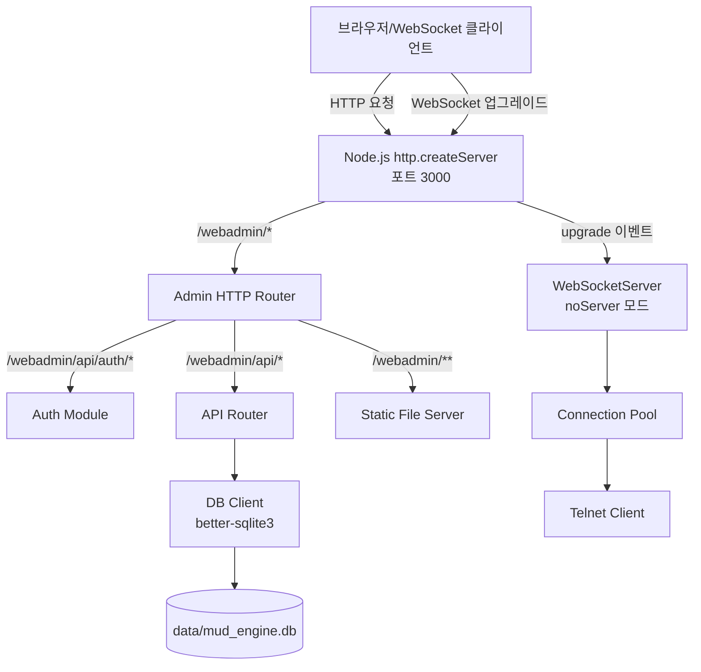
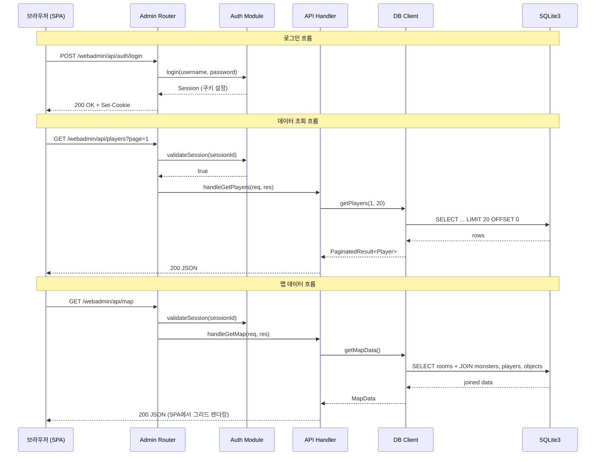

# 설계 문서: Web Admin Panel

## 개요 (Overview)

Karnas Chronicles: Divided Dominion의 웹 관리자 패널은 기존 WebSocket 게이트웨이 서버(포트 3000)에 HTTP 핸들링을 추가하여 `/webadmin` 경로 아래에서 관리자 전용 웹 인터페이스를 제공한다.

현재 서버는 `ws` 패키지의 `WebSocketServer`를 직접 사용하여 포트 3000에서 WebSocket 연결만 처리한다. 이를 Node.js `http.createServer`를 사용하는 방식으로 변경하여 동일 포트에서 HTTP 요청과 WebSocket 업그레이드를 모두 처리한다.

핵심 설계 결정:
- Node.js 내장 `http` 모듈로 HTTP 서버를 생성하고, `WebSocketServer`는 `noServer` 모드로 전환하여 `upgrade` 이벤트를 수동 처리
- SQLite3 접근에 `better-sqlite3` (동기 API) 사용 — 관리자 패널의 요청 빈도가 낮고, 동기 API가 코드 복잡도를 줄임
- 프론트엔드는 순수 HTML/CSS/JS SPA로 구현, 서버에서 정적 파일로 서빙
- 세션 기반 인증: 환경 변수에 저장된 자격 증명으로 로그인, 메모리 내 세션 관리
- REST API는 `/webadmin/api/*` 경로에 리소스 기반 URL 구조로 노출

## 아키텍처 (Architecture)

### 서버 통합 아키텍처



### 모듈 구조

```
src/server/
├── gateway.ts              # 기존 파일 수정: http.createServer + WSS noServer 모드
├── start.ts                # 기존 파일 (변경 최소화)
├── webadmin/
│   ├── admin-router.ts     # HTTP 요청 라우팅 (정적 파일 + API)
│   ├── auth.ts             # 인증 모듈 (세션 관리, 로그인/로그아웃)
│   ├── db-client.ts        # SQLite3 데이터 접근 계층
│   ├── api/
│   │   ├── map-api.ts      # 대시보드 맵 데이터 API
│   │   ├── players-api.ts  # 플레이어 CRUD API
│   │   ├── rooms-api.ts    # 방 CRUD API
│   │   ├── monsters-api.ts # 몬스터 CRUD API
│   │   └── objects-api.ts  # 게임 오브젝트 CRUD API
│   └── public/             # 정적 프론트엔드 파일
│       ├── index.html      # SPA 진입점
│       ├── style.css       # 스타일시트
│       └── app.js          # SPA JavaScript
├── connection-pool.ts      # 기존 파일 (변경 없음)
├── telnet-client.ts        # 기존 파일 (변경 없음)
├── logger.ts               # 기존 파일 (변경 없음)
└── sanitizer.ts            # 기존 파일 (변경 없음)
```


## 컴포넌트 및 인터페이스 (Components and Interfaces)

### 1. Gateway Server 변경 (gateway.ts)

기존 `WebSocketServer({ port })` 방식에서 `http.createServer` + `WebSocketServer({ noServer: true })` 방식으로 전환한다.

```typescript
// 변경 전
this.wss = new WebSocketServer({ port: this.port });

// 변경 후
import http from 'http';

this.httpServer = http.createServer((req, res) => {
  this.adminRouter.handleRequest(req, res);
});

this.wss = new WebSocketServer({ noServer: true });

this.httpServer.on('upgrade', (req, socket, head) => {
  this.wss.handleUpgrade(req, socket, head, (ws) => {
    this.wss.emit('connection', ws, req);
  });
});

this.httpServer.listen(this.port);
```

GatewayServer 클래스에 `adminRouter: AdminRouter` 의존성을 추가한다. AdminRouter는 생성자에서 주입받는다.

### 2. Admin Router (admin-router.ts)

Node.js 내장 `http.IncomingMessage`와 `http.ServerResponse`를 직접 처리하는 라우터이다. Express 등 외부 프레임워크를 사용하지 않는다.

```typescript
interface AdminRouter {
  handleRequest(req: http.IncomingMessage, res: http.ServerResponse): void;
}
```

라우팅 로직:
- `POST /webadmin/api/auth/login` → AuthModule.login
- `POST /webadmin/api/auth/logout` → AuthModule.logout
- `GET /webadmin/api/auth/check` → AuthModule.checkSession
- `/webadmin/api/*` (인증 필요) → 리소스별 API 핸들러
- `/webadmin/*` → 정적 파일 서빙 (public/ 디렉토리)
- 그 외 경로 → 404 응답

### 3. Auth Module (auth.ts)

환경 변수 기반 단일 관리자 계정 인증이다.

```typescript
interface Session {
  id: string;
  createdAt: number;
  expiresAt: number;
}

interface AuthModule {
  login(username: string, password: string): Session | null;
  logout(sessionId: string): void;
  validateSession(sessionId: string): boolean;
  getSessionFromCookie(cookieHeader: string | undefined): string | null;
}
```

- 환경 변수: `WEBADMIN_USERNAME` (기본값: `admin`), `WEBADMIN_PASSWORD` (기본값: `admin`)
- 세션 만료: 24시간
- 세션 저장: 메모리 내 Map
- 쿠키: `webadmin_session=<sessionId>; HttpOnly; Path=/webadmin; SameSite=Strict`

### 4. DB Client (db-client.ts)

`better-sqlite3`를 사용한 동기 데이터 접근 계층이다.

```typescript
interface DBClient {
  // 맵 데이터
  getMapData(): MapData;

  // 플레이어 CRUD
  getPlayers(page: number, limit: number): PaginatedResult<Player>;
  getPlayerById(id: string): Player | null;
  createPlayer(data: CreatePlayerInput): Player;
  updatePlayer(id: string, data: UpdatePlayerInput): Player | null;
  deletePlayer(id: string): boolean;
  getPlayerInventory(playerId: string): GameObject[];

  // 방 CRUD
  getRooms(page: number, limit: number): PaginatedResult<Room>;
  getRoomById(id: string): Room | null;
  createRoom(data: CreateRoomInput): Room;
  updateRoom(id: string, data: UpdateRoomInput): Room | null;
  deleteRoom(id: string): boolean;
  getRoomConnections(x: number, y: number): RoomConnection[];
  createRoomConnection(data: CreateRoomConnectionInput): RoomConnection;
  deleteRoomConnection(id: string): boolean;

  // 몬스터 CRUD
  getMonsters(page: number, limit: number): PaginatedResult<Monster>;
  getMonsterById(id: string): Monster | null;
  createMonster(data: CreateMonsterInput): Monster;
  updateMonster(id: string, data: UpdateMonsterInput): Monster | null;
  deleteMonster(id: string): boolean;

  // 게임 오브젝트 CRUD
  getGameObjects(page: number, limit: number): PaginatedResult<GameObject>;
  getGameObjectById(id: string): GameObject | null;
  createGameObject(data: CreateGameObjectInput): GameObject;
  updateGameObject(id: string, data: UpdateGameObjectInput): GameObject | null;
  deleteGameObject(id: string): boolean;

  // 통계
  getStats(): DashboardStats;

  close(): void;
}
```

모든 쿼리는 매개변수화된 쿼리(parameterized query)를 사용한다. UUID v4는 Node.js `crypto.randomUUID()`로 생성한다.

### 5. API 핸들러

각 리소스별 API 핸들러는 HTTP 메서드와 경로를 매칭하여 DBClient 메서드를 호출한다.

```typescript
// 공통 핸들러 시그니처
type APIHandler = (
  req: http.IncomingMessage,
  res: http.ServerResponse,
  params: RouteParams
) => void;

interface RouteParams {
  id?: string;        // URL 경로에서 추출한 리소스 ID
  query: URLSearchParams;  // 쿼리 파라미터
}
```

### 6. 프론트엔드 SPA (public/)

순수 HTML/CSS/JS로 구현된 단일 페이지 애플리케이션이다. 해시 기반 라우팅(`#dashboard`, `#players`, `#rooms`, `#monsters`, `#objects`)을 사용한다.

```
index.html
├── 내비게이션 메뉴 (사이드바)
├── 콘텐츠 영역
│   ├── #dashboard  → 대시보드 (월드 맵 + 통계)
│   ├── #players    → 플레이어 관리 (목록/생성/수정/삭제)
│   ├── #rooms      → 방 관리 (목록/생성/수정/삭제/연결)
│   ├── #monsters   → 몬스터 관리 (목록/생성/수정/삭제)
│   └── #objects    → 게임 오브젝트 관리 (목록/생성/수정/삭제)
└── 모달/폼 오버레이
```


## API 엔드포인트 명세

### 인증 API

| 메서드 | 경로 | 설명 | 인증 필요 |
|--------|------|------|-----------|
| POST | `/webadmin/api/auth/login` | 로그인 | 아니오 |
| POST | `/webadmin/api/auth/logout` | 로그아웃 | 예 |
| GET | `/webadmin/api/auth/check` | 세션 유효성 확인 | 예 |

### 대시보드 API

| 메서드 | 경로 | 설명 |
|--------|------|------|
| GET | `/webadmin/api/map` | 월드 맵 데이터 (rooms + monsters + players + objects 조인) |
| GET | `/webadmin/api/stats` | 대시보드 통계 (각 테이블 레코드 수) |

### 플레이어 API

| 메서드 | 경로 | 설명 |
|--------|------|------|
| GET | `/webadmin/api/players?page=1&limit=20` | 플레이어 목록 (페이지네이션) |
| GET | `/webadmin/api/players/:id` | 플레이어 상세 |
| POST | `/webadmin/api/players` | 플레이어 생성 |
| PUT | `/webadmin/api/players/:id` | 플레이어 수정 |
| DELETE | `/webadmin/api/players/:id` | 플레이어 삭제 |
| GET | `/webadmin/api/players/:id/inventory` | 플레이어 인벤토리 |

### 방 API

| 메서드 | 경로 | 설명 |
|--------|------|------|
| GET | `/webadmin/api/rooms?page=1&limit=20` | 방 목록 (페이지네이션) |
| GET | `/webadmin/api/rooms/:id` | 방 상세 |
| POST | `/webadmin/api/rooms` | 방 생성 |
| PUT | `/webadmin/api/rooms/:id` | 방 수정 |
| DELETE | `/webadmin/api/rooms/:id` | 방 삭제 |
| GET | `/webadmin/api/rooms/:id/connections` | 방 연결 목록 |
| POST | `/webadmin/api/room-connections` | 방 연결 생성 |
| DELETE | `/webadmin/api/room-connections/:id` | 방 연결 삭제 |

### 몬스터 API

| 메서드 | 경로 | 설명 |
|--------|------|------|
| GET | `/webadmin/api/monsters?page=1&limit=20` | 몬스터 목록 (페이지네이션) |
| GET | `/webadmin/api/monsters/:id` | 몬스터 상세 |
| POST | `/webadmin/api/monsters` | 몬스터 생성 |
| PUT | `/webadmin/api/monsters/:id` | 몬스터 수정 |
| DELETE | `/webadmin/api/monsters/:id` | 몬스터 삭제 |

### 게임 오브젝트 API

| 메서드 | 경로 | 설명 |
|--------|------|------|
| GET | `/webadmin/api/objects?page=1&limit=20` | 게임 오브젝트 목록 (페이지네이션) |
| GET | `/webadmin/api/objects/:id` | 게임 오브젝트 상세 |
| POST | `/webadmin/api/objects` | 게임 오브젝트 생성 |
| PUT | `/webadmin/api/objects/:id` | 게임 오브젝트 수정 |
| DELETE | `/webadmin/api/objects/:id` | 게임 오브젝트 삭제 |

### 공통 응답 형식

성공 응답:
```json
{
  "data": { ... },
  "pagination": {
    "page": 1,
    "limit": 20,
    "total": 173,
    "totalPages": 9
  }
}
```

오류 응답:
```json
{
  "error": "설명적 오류 메시지",
  "field": "username"  // 유효성 검사 오류 시
}
```


## 데이터 모델 (Data Models)

### 서버 측 타입 정의

```typescript
// 페이지네이션 공통 타입
interface PaginatedResult<T> {
  data: T[];
  pagination: {
    page: number;
    limit: number;
    total: number;
    totalPages: number;
  };
}

// 대시보드 맵 데이터
interface MapData {
  rooms: MapRoom[];
  stats: DashboardStats;
}

interface MapRoom {
  id: string;
  x: number;
  y: number;
  description_en: string | null;
  description_ko: string | null;
  blocked_exits: string[];
  creatures: MapCreature[];
  players: MapPlayer[];
  items: MapItem[];
  enter_connections: { to_x: number; to_y: number }[];
}

interface MapCreature {
  name_en: string;
  name_ko: string;
  hp: number;
  faction: string;
  faction_id: string;
}

interface MapPlayer {
  username: string;
  is_admin: boolean;
}

interface MapItem {
  name_en: string;
  name_ko: string;
  type: string;
}

interface DashboardStats {
  players: number;
  rooms: number;
  monsters: number;
  gameObjects: number;
}

// 플레이어
interface Player {
  id: string;
  username: string;
  email: string | null;
  preferred_locale: string;
  is_admin: boolean;
  display_name: string | null;
  faction_id: string;
  last_login: string | null;
  last_room_x: number;
  last_room_y: number;
  stat_strength: number;
  stat_dexterity: number;
  stat_intelligence: number;
  stat_wisdom: number;
  stat_constitution: number;
  stat_charisma: number;
  created_at: string;
}

interface CreatePlayerInput {
  username: string;
  password: string;
  email?: string;
  preferred_locale?: string;
  is_admin?: boolean;
  display_name?: string;
  faction_id?: string;
}

interface UpdatePlayerInput {
  username?: string;
  email?: string;
  preferred_locale?: string;
  is_admin?: boolean;
  display_name?: string;
  faction_id?: string;
  last_room_x?: number;
  last_room_y?: number;
  stat_strength?: number;
  stat_dexterity?: number;
  stat_intelligence?: number;
  stat_wisdom?: number;
  stat_constitution?: number;
  stat_charisma?: number;
}

// 방
interface Room {
  id: string;
  x: number;
  y: number;
  description_en: string | null;
  description_ko: string | null;
  blocked_exits: string[];
  created_at: string;
  updated_at: string;
}

interface CreateRoomInput {
  x: number;
  y: number;
  description_en?: string;
  description_ko?: string;
  blocked_exits?: string[];
}

interface UpdateRoomInput {
  x?: number;
  y?: number;
  description_en?: string;
  description_ko?: string;
  blocked_exits?: string[];
}

// 방 연결
interface RoomConnection {
  id: string;
  from_x: number;
  from_y: number;
  to_x: number;
  to_y: number;
  created_at: string;
}

interface CreateRoomConnectionInput {
  from_x: number;
  from_y: number;
  to_x: number;
  to_y: number;
}

// 몬스터
interface Monster {
  id: string;
  name_en: string;
  name_ko: string;
  description_en: string | null;
  description_ko: string | null;
  monster_type: string;
  behavior: string;
  stats: Record<string, unknown>;
  drop_items: unknown[];
  respawn_time: number;
  is_alive: boolean;
  aggro_range: number;
  roaming_range: number;
  properties: Record<string, unknown>;
  x: number | null;
  y: number | null;
  faction_id: string | null;
  created_at: string;
}

interface CreateMonsterInput {
  name_en: string;
  name_ko: string;
  description_en?: string;
  description_ko?: string;
  monster_type?: string;
  behavior?: string;
  stats?: Record<string, unknown>;
  drop_items?: unknown[];
  respawn_time?: number;
  aggro_range?: number;
  roaming_range?: number;
  properties?: Record<string, unknown>;
  x?: number;
  y?: number;
  faction_id?: string;
}

interface UpdateMonsterInput {
  name_en?: string;
  name_ko?: string;
  description_en?: string;
  description_ko?: string;
  monster_type?: string;
  behavior?: string;
  stats?: Record<string, unknown>;
  drop_items?: unknown[];
  respawn_time?: number;
  aggro_range?: number;
  roaming_range?: number;
  properties?: Record<string, unknown>;
  x?: number;
  y?: number;
  faction_id?: string;
}

// 게임 오브젝트
interface GameObject {
  id: string;
  name_en: string;
  name_ko: string;
  description_en: string | null;
  description_ko: string | null;
  object_type: string;
  location_type: string;
  location_id: string | null;
  properties: Record<string, unknown>;
  weight: number;
  max_stack: number;
  category: string;
  equipment_slot: string | null;
  is_equipped: boolean;
  created_at: string;
}

interface CreateGameObjectInput {
  name_en: string;
  name_ko: string;
  object_type: string;
  location_type: string;
  location_id?: string;
  description_en?: string;
  description_ko?: string;
  properties?: Record<string, unknown>;
  weight?: number;
  max_stack?: number;
  category?: string;
  equipment_slot?: string;
  is_equipped?: boolean;
}

interface UpdateGameObjectInput {
  name_en?: string;
  name_ko?: string;
  description_en?: string;
  description_ko?: string;
  object_type?: string;
  location_type?: string;
  location_id?: string;
  properties?: Record<string, unknown>;
  weight?: number;
  max_stack?: number;
  category?: string;
  equipment_slot?: string;
  is_equipped?: boolean;
}
```

### 데이터 흐름



